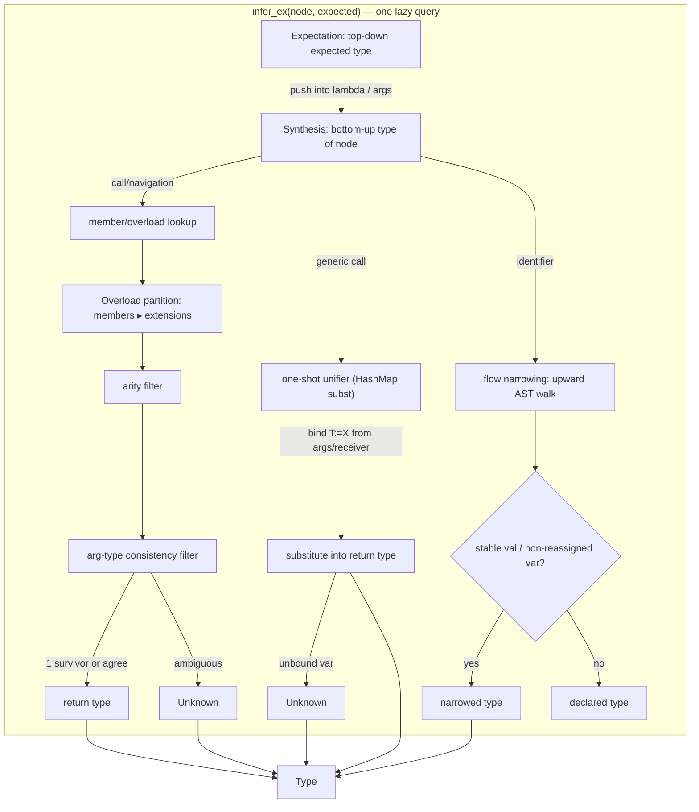
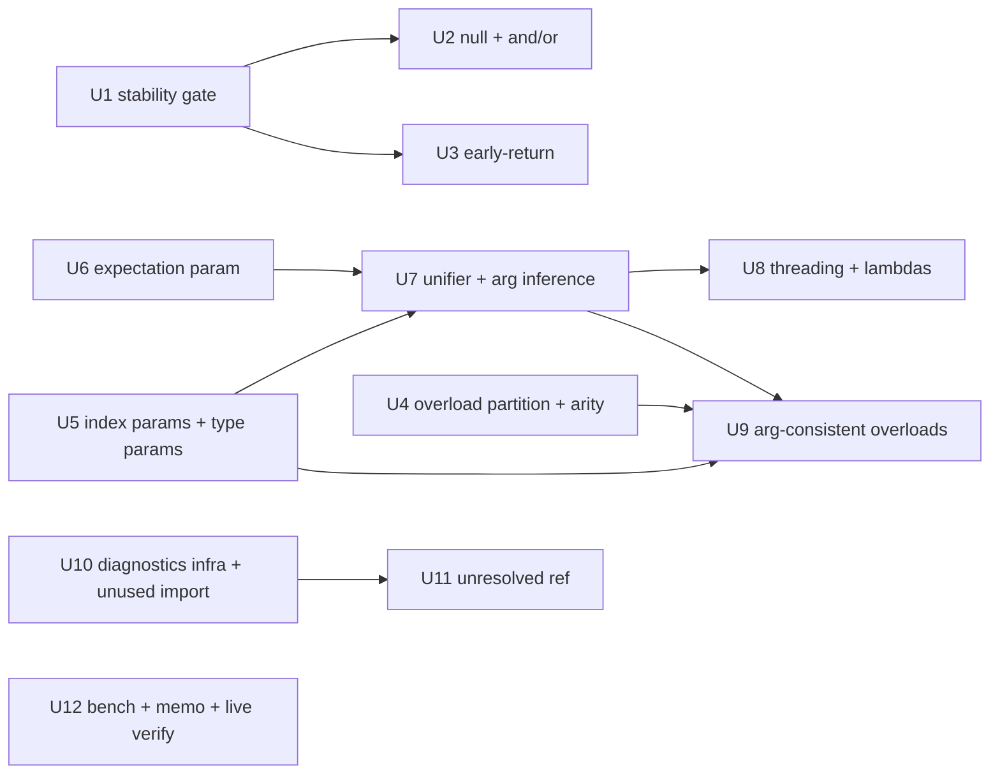

# feat: Evolve `infer()` into a `ty`/pyright-style gradual type checker

This plan lifts the deferred items in the type-inference stop line (`docs/plans/type-inference.md` §8)
to take ktlsp from a best-effort *resolver* to a *gradual checker* — `ty`/pyright-style, not
Kotlin-grade. It is the roadmap behind "what would a real type checker give us, and what's the 80/20
we can actually build compiler-free?"

The governing insight from research: **this is not a constraint-solver rewrite.** The existing
demand-driven `infer(index, node, src, ctx) -> Type` is already the right spine (TypeScript's lazy,
walk-back-from-the-reference model). Each notch is an *extension* of it — a bidirectional expectation
parameter, a per-call-local one-shot unifier, an overload *partition*, and a lazy AST-as-CFG
narrowing walk — with **no global constraint set, no CFG, no batch pass**. Every notch only ever
*replaces a `Type::Unknown` with a concrete type*; it can never turn a correct answer wrong. That
monotonicity is what preserves the project's identity (no JVM, no kotlinc, fast, silent-omission).

---

## Summary

Four notches, sequenced low-risk → high-risk:

- **Flow typing** — add a smart-cast **stability gate** (the current `var` narrowing is unsound), then
  null-check / `&&`/`||` / early-return narrowing. Pure AST traversal, no schema change.
- **Index enrichment** — store parameter types and formal type-parameter names on `IndexedSymbol`
  (one `SYMCACHE_VERSION` bump). The single data-model change the rest depends on.
- **Bidirectional generics** — thread an optional `expected: Option<&Type>` through `infer`, plus a
  per-call-local one-shot unifier, to get argument inference (`listOf(x) -> List<X>`) and one-to-two
  levels of threading through chains and lambdas (`xs.map { it.foo }`).
- **Overload resolution** — a member-before-extension *partition* + arity + argument-type *consistency*
  filter; pick only when one survivor (or all survivors agree on return type), else `Unknown`.
- **Diagnostics** (final, highest-risk, clearly gated) — `publishDiagnostics` for **name-based** issues
  only (unused import, unresolved reference), gated on a clean parse and fully-resolved types. **No
  type-mismatch / assignability / exhaustiveness errors** — those require a real type system and
  would violate the no-wrong-result contract.

---

## Problem Frame

ktlsp's `infer()` (`src/infer.rs`) is a local, syntactic, demand-driven resolver: literal → type,
call → stored return type, navigation → member type, plus hand-coded smart-cast narrowing and a
single-type-variable generic substitution (`substitute_type_var`). It answers "what type is this,
probably?" and says `Unknown` when unsure. That is excellent for goto/completion/hover on simple
shapes, but it degrades fast exactly where idiomatic Kotlin lives:

- **Collections + lambdas** — `users.filter { }.map { it. }` loses the element type; `listOf(x)` can't
  infer `List<X>`. This is the single biggest completion gap.
- **Overloads** — any overloaded call is approximate; the resolver takes the first by name.
- **Flow** — narrowing only fires in the immediate `if`-then / `when`-entry; `if (x == null) return`,
  `&&`/`||`, and (critically) `var`-stability are unhandled. The `var` case is currently **unsound**:
  `if (x is T) { x = other; x.fooOnT }` would wrongly narrow.
- **No diagnostics at all** — best-effort inference can't safely emit errors, so ktlsp surfaces none.

A `ty`/pyright-style *gradual* checker closes these while keeping the compiler-free, fast, never-wrong
posture. The non-goal is Kotlin-grade completeness — that *is* kotlin-lsp, the thing this project
exists to avoid.

---

## Goals / Non-Goals

**Goals (what we lift from the §8 stop line, preserving the never-wrong invariant):**

- R1 — Argument-based generic inference: `listOf(x) -> List<X>`, `mapOf(...)` element/key/value types.
- R2 — Generic threading through call chains and lambdas: `xs.map { it.foo }` resolves `it` and the
  result element type (1–2 levels; deeper degrades to `Unknown`).
- R3 — Lambda parameter/return inference from the expected (contextual) type — `it` in `map`/`filter`/
  `fold`/etc., not just `let`/`also`.
- R4 — Overload resolution by member/extension priority + arity + argument-type consistency; a
  confident single pick, or `Unknown` when ambiguous.
- R5 — Flow narrowing: `x != null`, `if (x == null) return/throw/break/continue`, `&&`/`||`
  short-circuit.
- R6 — Smart-cast **stability gate**: only narrow stable values (a correctness fix; today's `var`
  narrowing is unsound).
- R7 — High-confidence **name-based** diagnostics: unused imports (pure name-usage — no type
  resolution) and unresolved references (additionally gated on fully-resolved types); both gated on a
  clean parse; silent on any `Unknown` / ambiguity / ERROR-recovered region.
- R8 — Preserve silent-omission and performance: no notch produces a wrong result; goto stays
  sub-millisecond; perf is bench-guarded before any memo is added.
- R9 — Index parameter types and formal type-parameter names on `IndexedSymbol` (schema + version
  bump), flowing through project and library symbols.

**Non-Goals (stay silent / `Unknown`; documented in Scope Boundaries):**

- Full Kotlin overload resolution — most-specific-candidate algorithm, SAM conversion, numeric
  widening, implicit coercions, operator-overload (`+`/`[]`/`in`) resolution.
- Whole-program / fixpoint inference — cross-statement deferred type variables
  (`val xs = mutableListOf(); xs.add(1)` back-propagating `Int`), loop back-edge narrowing, branch
  join/LUB merges, variance.
- **Type-mismatch / assignability / exhaustiveness diagnostics** — these require a sound type system;
  a false positive is a wrong result shown to the user. Explicitly out.
- Platform/flexible types (`T!`), intersection types, builder inference, contracts
  (`requireNotNull`/`contract {}`), property delegation result types, alias/escape analysis.

---

## High-Level Technical Design

The architecture stays a single demand-driven query; the additions are an expectation parameter
(checking direction), a per-call-local substitution map, and a few extra narrowing recognizers — all
born and discarded inside one `infer` invocation.

Phase dependency graph (implementation order):

The new pure-core modules: `src/solve.rs` (the unifier + substitution), `src/diagnostics.rs` (the
name-based checks). Flow narrowing and overload resolution extend `src/infer.rs` in place. `src/lsp.rs`
gains only the `publishDiagnostics` wiring + byte→UTF-16 conversion (the core/LSP split holds).

---

## Key Technical Decisions

**KTD1 — Bidirectional, not a solver.** Add `expected: Option<&Type>` to the inference walk (rename the
internal `infer_depth` to carry it; keep `infer()` as the `expected = None` entry). Generic argument
inference uses a *per-application* `HashMap<String, Type>` and a one-shot directional `unify_into`
(match formal against actual, bind type-variable names, never propagate or merge). No `ena`/Chalk,
no union-find, no global constraint set. Rationale: rust-analyzer needs a solver for *sound
whole-function* inference with subtyping; ktlsp needs only the 1–2 levels of threading a user sees in
completion (Pierce & Turner local inference restricted to a single application). First binding wins;
heads-differ → no bind; unbound-after-one-shot → `Unknown`. (Research: Pierce & Turner; Dunfield &
Krishnaswami; rust-analyzer `Expectation`; pyright contextual typing.)

**KTD2 — `Unknown` directionality (the gradual rule).** `Unknown` **absorbs** as an expectation
(`check(e, Unknown) == infer(e)`; an `Unknown` formal/expected never overwrites a synthesized type)
and **propagates to empty** as a result (`Unknown.member == Unknown`, yielding zero candidates). Keep
`Type::Unknown` nullary; do **not** add a separate `Any` — "user wrote it" and "I gave up" both behave
silently. This asymmetry is what stops `Unknown` from both erroring everywhere and autocompleting
garbage. (Research: Siek & Taha consistency — reflexive/symmetric, not transitive; `ty` gradual
guarantee; mypy/pyright `Any`.)

**KTD3 — Overload as a partition, not a contest.** Member candidates (from `index.members_of` + the
supertype walk) rank as a *group* above extensions (`index.extensions_for`) — **first non-empty group
wins**, even over a more specific later extension (this is Kotlin's actual priority-group rule and a
huge ambiguity reducer, and the two buckets are already indexed separately). Then arity filter, then
argument-type *consistency* (not strict subtyping; `Unknown` arg never eliminates a candidate). Decide:
1 survivor → its return type; ≥2 that **agree** on return type → that type; else → `Unknown`. We never
implement the most-specific-candidate tiebreaker chain — we only need the *result* type, not the
named overload. (Research: Kotlin spec Overload resolution; gradual-consistency for arguments.)

**KTD4 — Flow narrowing stays a lazy upward AST walk; the AST is the CFG.** No control-flow graph, no
forward pass. Branch narrowing = ancestor walk + byte-range containment (already built); early-return
narrowing = bounded preceding-sibling scan for `if (<guard on x>) <terminating-stmt>`; `&&`/`||` =
operand-position check within one `binary_expression`. The **stability gate** is mandatory and
safety-critical: resolve the binding via `resolve::local_decl`; narrow freely for a `val` param/local;
for a `var`, scan for any reassignment between check and use and refuse to narrow if found; refuse for
members that might have a custom getter. (Research: TypeScript `getFlowTypeOfReference`; pyright
narrowing-on-exit; Kotlin smart-cast stability rules.)

**KTD5 — Diagnostics are name-based and clean-parse-gated, never type-mismatch.** The silent-omission
contract *inverts* for diagnostics: emit one **only when provably wrong** — every relevant type is
`Type::Class { package: Some(_) }` with no `Unknown` in the chain, AND the region has no `ERROR`
ancestry (the one-line-class collapse makes ERROR-recovered subtrees provably partial → suppress).
Scope to two safe checks: **unused import** (no in-file reference to the imported name) and
**unresolved reference** (a name that resolves to nothing, with full information present). No
assignability/exhaustiveness. Compute on `did_open`/`did_change` off the cached tree, **debounced**
(~300 ms) because the server is FULL-sync and fires per keystroke. (Research: silent-omission
enforcement points; ERROR-collapse gotcha; `ty`/pyright emit errors only because they have a full
type system — ktlsp must not.)

**KTD6 — Schema change batched into one version bump.** Adding `params: Vec<TypeRef>` and
`type_params: Vec<String>` to `IndexedSymbol` is the pre-planned v4→v5 (`docs/plans/type-inference.md`
§4.1). bincode is positional: `#[serde(default)]` is documentation parity only — the **`SYMCACHE_VERSION`
bump in `src/deps.rs` is the load-bearing compat mechanism** and must land in the same commit. Stamp
the fields in `src/indexer.rs` (struct-update), teach `src/java.rs` (or leave empty → `Unknown`,
acceptable), and they flow to library symbols free via `src/deps.rs::parse_dir`.

**KTD7 — Bench before optimizing; `references()` is the canary.** A file-wide diagnostics pass is a new
fan-out workload (the existing perf reasoning assumed one receiver per keystroke). Extend
`examples/bench.rs` with a chained-generic and a smart-cast case; measure against the ~30µs-warm goto
target before adding the pre-designed memo (side-table keyed by real-file `(path, start_byte)`, cleared
on `change()`). Note on the `references()` canary: it calls `resolve::goto` per candidate (up to ~5000),
but `goto` only invokes `infer` for **member-selector** usages (`UseKind::MemberSelector`) — a value
reference or a bare name like `it` never hits `infer`. So the worst-case bench must exercise a
**member-selector-heavy** symbol (e.g. a widely-called method), not just any high-frequency name.

---

## Implementation Units

Grouped into phases. U-IDs are stable. Every feature-bearing unit lists test files and scenarios;
new fixture tests mirror `tests/completion.rs` (`/*^*/` cursor, `//- <key>` headers,
`check_contains`/`check_excludes`/`check_none`) and `tests/goto.rs` (`/*def*/` markers), staying
hermetic by defining their own types inline.

### Phase A — Flow typing hardening (no schema change)

### U1. Smart-cast stability gate

**Goal:** Make existing narrowing sound — never narrow a value that isn't stable. Today
`narrowed_type_name` narrows any matching identifier, which is unsound for reassigned `var`s.

**Requirements:** R6, R8.
**Dependencies:** none.
**Files:** `src/infer.rs` (gate inside `narrowed_type_name` / `if_narrowing` / `when_entry_narrowing`),
`tests/completion.rs`.

**Approach:** Before applying any narrowed type, resolve the binding via `resolve::local_decl`, which
returns `(Node, SymbolKind)`. **A `SymbolKind::Parameter` is always stable** (Kotlin parameters are
immutable) — narrow freely, no further check. For a `SymbolKind::LocalVariable`, `local_decl` returns
the same kind for both `val` and `var`, so distinguish them at the AST level: from the identifier node,
go up to its `variable_declaration` parent, then to *its* `property_declaration` parent, and test
`has_child_token(property_declaration, "val")` — `val`/`var` are **anonymous token children** of
`property_declaration` (invisible to `named_children`). A `val` local ⇒ stable, narrow. A `var` local ⇒
scan the enclosing block for an assignment to that name with `start_byte` between the narrowing site and
the use; if any, refuse (return declared type). A member/property that can't be proven to lack a custom
getter ⇒ refuse. Re-dump grammar to confirm BOTH the `val`/`var` keyword tokens on `property_declaration`
AND the assignment node shape (`assignment` / `=` token); reuse `has_child_token` for both. This is
monotone-safe: refusing narrowing falls back to the declared type, never a wrong one.

**Patterns to follow:** the conservative-by-construction style of `substitute_type_var`
(`src/infer.rs`); the upward-walk + byte-range containment already in `if_narrowing`.

**Test scenarios:**
- `val x: Any` smart-cast in `if (x is T)` still narrows (no regression). `check_contains`.
- `var x: Any` reassigned to a non-T between `if (x is T)` and use → NOT narrowed. `check_excludes` the
  T-only member; assert the declared-type members instead.
- `var x: Any` checked and used with no intervening reassignment → narrowed. `check_contains`.
- A property with a custom getter checked via `is` → not narrowed. `check_excludes`.
**Verification:** the new `var`-reassignment fixture offers no T-only members; all prior smart-cast
tests stay green.

### U2. Null-check and `&&`/`||` narrowing

**Goal:** Narrow `x` to non-null in `if (x != null) { … }`, the else of `if (x == null)`, and the
short-circuit operand of `&&`/`||`.

**Requirements:** R5, R8.
**Dependencies:** U1 (shares the narrowing + stability path).
**Files:** `src/infer.rs`, `tests/completion.rs`.

**Approach:** Extend the upward walk to recognize a `binary_expression` condition with a `==`/`!=`
operator whose operands are identifier `x` and `null`. `x != null` strips nullability in the
then-branch (`Type::into_non_null`); `x == null` narrows the else-branch. For `&&`/`||`: when the
identifier is in the **right** operand of a `binary_expression` with `&&`, and the **left** operand is a
null/`is` guard on the same name, narrow; symmetric for `||` with the negated guard. All gated by U1's
stability check. Re-dump grammar for the `binary_expression` operator and else-branch shapes:
`binary_expression` exposes its operator as a **named `operator` field** (`child_by_field_name("operator")`,
cleaner than `has_child_token` for the operand-position logic here) — confirm this and the `==`/`!=`/
`&&`/`||` token text via dump before relying on it.

**Patterns to follow:** `if_narrowing` branch-containment; `into_non_null` (`src/types.rs`); the
anonymous-token rule.

**Test scenarios:**
- `fun f(x: Foo?) { if (x != null) { x.<member> } }` → member offered. `check_contains`.
- `if (x == null) { } else { x.<member> }` → offered in else. `check_contains`.
- `if (x == null) { x.<member> }` → NOT offered in then. `check_none`/`check_excludes`.
- `x != null && x.<member>` (right operand) → offered. `check_contains`.
- `x == null || x.<member>` → offered. `check_contains`.
- negated/`var`-unstable variants → not narrowed (ties to U1).
**Verification:** each null/`&&`/`||` fixture narrows in the safe position and stays silent in the
unsafe one.

### U3. Early-return / jumping-guard narrowing

**Goal:** `if (x == null) return` (or `throw`/`break`/`continue`) narrows `x` for the rest of the
enclosing block.

**Requirements:** R5, R8.
**Dependencies:** U1, U2 (guard recognition).
**Files:** `src/infer.rs`, `tests/completion.rs`.

**Approach:** When resolving identifier `x` at position `P`, scan preceding sibling statements in the
enclosing block for an `if_expression` whose condition is a `<guard on x>` (its negation narrows `x`)
and whose **then-branch is a terminating statement**. Grammar note (re-dump to confirm, add a dump line
to this unit): `if (x == null) return` parses as `if_expression(condition, return_expression)` — the
terminating statement is the if's **then-branch child** (e.g. `return_expression`/`jump_expression`),
**not** a separate sibling and **not** a `block`. So read it from the then-branch child and check its
kind is `return`/`throw`/`break`/`continue`-shaped (syntactic, no reachability solver). If found and `P`
is after the `if_expression`, apply the negated-guard narrowing (stability-gated via U1). Bounded
backward scan; no CFG.

**Patterns to follow:** the bounded preceding-sibling scan style of `scan_block` (`src/resolve.rs`); the
then-branch child access in `if_narrowing` (`src/infer.rs`).

**Test scenarios:**
- `fun f(x: Foo?) { if (x == null) return; x.<member> }` → offered after the guard. `check_contains`.
- `if (x !is T) return; x.<T member>` → offered. `check_contains`.
- before the guard line → not narrowed.
- guard without a terminating statement (`if (x == null) {}`) → not narrowed past it. `check_excludes`.
**Verification:** narrowing applies only on statements that follow a terminating guard.

### Phase B — Index enrichment

### U4. Member-vs-extension overload partition + arity filter

**Goal:** Replace "first member by name" in `member_type` with the priority-group partition + arity
filter (the part of overload resolution that needs no new data).

**Requirements:** R4, R8.
**Dependencies:** none.
**Files:** `src/infer.rs` (`member_type`, `infer_call`), `tests/completion.rs`, `tests/goto.rs`.

**Approach:** Collect name-matching candidates tagged `Member` (from `members_of` + supertype walk) vs
`Extension` (from `extensions_for`). First non-empty group wins — if any member matches, discard all
extensions before looking further. Filter by `arity` (already stored): drop candidates whose value-
param count can't accept the call's argument count; keep candidates with `arity == None` or possible
defaults (conservative). Decide: 1 survivor → its return type; ≥2 agreeing on return type → that type;
else `Unknown`.

**Patterns to follow:** the existing supertype-walk in `member_type`; the unique-only fallback posture
in `resolve::resolve_member`.

**Test scenarios:**
- a member and a same-named extension both exist → the member wins (return type/goto). `check_contains`
  / goto `/*def*/` on the member.
- two overloads of different arity, call matches one → that overload's return type drives the next
  `.member`. `check_contains`.
- two overloads, same arity, different return types → `Unknown` (no members). `check_none`.
**Verification:** member beats extension; arity disambiguates; conflicting returns stay silent.

### U5. Index parameter types and formal type parameters

**Goal:** Store `params: Vec<TypeRef>` (function value-parameter types) and `type_params: Vec<String>`
(declared formal type-parameter names of functions and types) on `IndexedSymbol`. The data-model
foundation for U7/U9.

**Requirements:** R9, R8.
**Dependencies:** none.
**Files:** `src/symbol.rs` (fields + `#[serde(default)]`), `src/indexer.rs` (extraction + stamping +
unit tests), `src/deps.rs` (`SYMCACHE_VERSION` v4→v5), `src/java.rs` (leave empty or extract),
`examples/bench.rs` (no behavior change; ensure stdlib still indexes).

**Approach:** Extract param types from `function_value_parameters` → `parameter` → the `user_type`/
`nullable_type` child (reuse the `type_ref_from` helpers). Extract `type_params` from the
`type_parameters` node (the `<T, R>` before the receiver/name) on both `function_declaration` and
`class_declaration`/`object_declaration`. Stamp via struct-update (mirror `return_type`/`value_type`).
**Bump `SYMCACHE_VERSION` in the same commit** — bincode is positional; the bump (not `serde(default)`)
is what invalidates stale `.bin`. Re-dump grammar for `type_parameters`/`parameter` shapes and cite it.

**Patterns to follow:** `return_type_of` / `value_type_of` / `type_ref_from` (`src/indexer.rs`); the
field-doc + `#[serde(default)]` convention (`src/symbol.rs`); the version-bump rationale
(`docs/plans/type-inference.md` §4.1).

**Test scenarios:**
- `fun f(a: Int, b: String): R` → `params == [Int, String]`. (indexer unit test, mirror
  `return_and_value_types_recorded`.)
- `fun <T, R> map(...)` → `type_params == ["T", "R"]`.
- `class Box<T>` → `type_params == ["T"]`.
- nullable + generic param types captured (`a: List<Foo>?`).
- a stale v4 symcache is ignored after the v5 bump (no corruption) — assert via the fingerprint
  including `SYMCACHE_VERSION`.
**Verification:** indexer unit tests pass; library symbols carry params after a reindex; no stale-cache
corruption.

### Phase C — Bidirectional generic inference

### U6. Expectation parameter + gradual `Unknown` directionality

**Goal:** Thread an optional expected type through inference (the checking direction), with the gradual
absorb-on-input / propagate-to-empty-on-output rule.

**Requirements:** R3, R2, R8, KTD2.
**Dependencies:** none (refactor of `infer`).
**Files:** `src/infer.rs`, `tests/completion.rs`.

**Approach:** Rename the internal `infer_depth` to carry `expected: Option<&Type>`; `infer()` stays the
public `expected = None` entry. Implement the directional rule: an `Unknown` expectation never
overwrites a synthesized concrete type; `Unknown` as a synthesized result propagates to empty members
(already the case in `member_type`). This unit is mostly plumbing + the directionality invariant; the
consumers are U7/U8. Keep `Type::Unknown` nullary (no `Any`).

**Patterns to follow:** the existing `infer_depth` dispatch; `Type::Unknown` handling in `member_type`.

**Test scenarios:**
- regression: all existing inference/completion tests still pass (expected=None path unchanged).
- an `Unknown` expectation on an expression still synthesizes its real type (e.g. a literal in an
  unknown-typed context). `check_contains`.
**Verification:** no regression in the 80+ existing inference tests; expectation defaults to None
everywhere it's not yet supplied.

### U7. One-shot local unifier + argument-based generic inference

**Goal:** Single-collection argument inference — `listOf(x) -> List<X>`, `setOf(x) -> Set<X>`. (Two-key
forms like `mapOf(a to b)` are explicitly **out of this unit** — see Approach.)

**Requirements:** R1, R8.
**Dependencies:** **U5 (param + type_param data) is the hard dependency.** U6 is needed only for the
expected-type-driven argument-synthesis path; the unifier core (`unify_into`, a pure
`HashMap<String, Type>` matcher in `solve.rs`) has no logical dependency on U6 and can be written and
tested first.
**Files:** `src/solve.rs` (new pure module: `unify_into`, substitution), `src/infer.rs` (`infer_call`
wiring only — see the substitute_type_var note below), `src/lib.rs` (module decl), `tests/completion.rs`.

**Approach:** In `infer_call`, for a call to a function with `type_params`, synthesize each argument
bottom-up, then run `unify_into(formal_param, actual_arg, &type_params_set, &mut subst)` per argument
(match-don't-propagate: bind a type-var name to the actual; same-head → recurse positionally into args;
heads differ → no bind). Substitute `subst` through the declared return `TypeRef` to produce the result
`Type`. **Type-variable identity decision (resolve it HERE, not in U8):** decide whether "this name is a
type variable" comes from the callee's `type_params` set (from U5 — the principled choice) or from the
existing `substitute_type_var` heuristic (`index.lookup_type` empty). Prefer the `type_params` set;
introduce a `Type::TypeParam { name }` variant only if the unifier genuinely needs to carry type-variable
identity through substitution (U8 then reuses whatever this unit decides). Termination via the existing
`MAX_DEPTH` guard (no occurs-check needed for match-don't-propagate; add the trivial refuse-self-bind
guard). Unbound variable after the one shot → `Unknown`.

**`substitute_type_var` coexistence (critical — do NOT remove it):** `substitute_type_var` is called in
**two** places — `infer_call` (the method-call path this unit touches) AND the supertype-walk loop in
`member_type` (the navigation-chain path `xs.first() -> Foo`). This unit adds `unify_into` to the
**`infer_call` arg-based path only**; the `substitute_type_var` call inside `member_type` stays
**unchanged** so navigation-chain inference doesn't regress. U8 extends the `member_type` path with
receiver-binding. Do not touch `member_type` in U7.

**mapOf is deferred (not one-shot-sized):** `mapOf(a to b)` parses the pair as an `infix_expression`
(`a`, `to`, `b`); resolving it needs the `to` infix → `Pair<K,V>` → two-variable substitution, which is
materially more than the single-collection one-shot. Leave `mapOf`/`Map` element completion to a
follow-up (degrades to `Unknown` until then — safe).

**Patterns to follow:** `substitute_type_var` (the no-wrong-answer guard it documents); `resolve_type_ref`
(`src/infer.rs`) for resolving a `TypeRef` to a `Type` at the use site.

**Test scenarios:**
- `listOf(Foo()).first().<Foo member>` (define `List<E>`/`listOf` inline) → offered. `check_contains`.
- `setOf(Foo()).first().<Foo member>` → offered.
- `listOf<Foo>()` explicit type argument still works (no regression with U5/U7).
- `xs.first().<member>` navigation-chain (existing `substitute_type_var` path) still works (regression
  guard for the coexistence rule). `check_contains`.
- heads-differ / unbound variable → `Unknown`. `check_none`.
- `Map<K,V>` (two args, no inference signal) and `mapOf(...)` stay `Unknown` rather than guessing.
  `check_none`.
**Verification:** single-collection argument inference yields element types; the navigation-chain path is
unregressed; ambiguous/unbindable/`mapOf` cases stay silent.

### U8. Generic threading through chains and lambdas

**Goal:** `xs.map { it.foo }` resolves `it` and the result element type; lambda parameters typed from
the expected functional type.

**Requirements:** R2, R3, R8.
**Dependencies:** U6, U7.
**Files:** `src/infer.rs` (`infer_call`, `member_type` receiver-binding, `it_receiver_type`, navigation
chains), `src/solve.rs`, `src/types.rs` (only if U7 chose to add `Type::TypeParam`), `tests/completion.rs`.

**Approach:** For `recv.member(lambda)` where `member`'s signature is generic (`fun <T,R> List<T>.map(f:
(T)->R): List<R>`): bind `T` from the receiver's element type (`substitute_type_var`/`unify_into` on
the receiver), then **push** the now-known lambda parameter type as the **expected** type of the trailing
lambda. Inside, `it` gets that parameter type (extend `it_receiver_type` to read an expected lambda-
param type, not just `let`/`also`). Synthesize the lambda body to learn `R`; substitute back for the
result element type. Cap at ~2 levels of threading. Reuse the type-variable-identity mechanism U7 chose
(`type_params` set or a `Type::TypeParam` variant) — do not introduce a second scheme. This unit also
extends the `member_type` receiver path (the `substitute_type_var` call U7 deliberately left unchanged)
with receiver-binding for the generic-member case.

**Patterns to follow:** `it_receiver_type` (`src/infer.rs`); the receiver-arg projection in
`substitute_type_var`; lambda node shapes (`annotated_lambda` / `lambda_literal`) verified via dump.

**Test scenarios:**
- `xs.map { it.<element member> }` where `xs: List<Foo>` → Foo members on `it`. `check_contains`.
- `xs.filter { it.<member> }` → element members on `it`.
- `xs.map { it.bar }.first().<member>` → result element threaded (2 levels). `check_contains`.
- a 3rd level → degrades to `Unknown` (documented cap). `check_none`.
- non-generic higher-order or unknown receiver → `it` stays `Unknown`. `check_none`.
**Verification:** `it`/result element types resolve through one and two levels; deeper stays silent.

### Phase D — Overload resolution (argument-aware)

### U9. Argument-type-consistent overload filtering

**Goal:** Among same-group, same-arity candidates, filter by argument-type consistency to reach a
confident single pick.

**Requirements:** R4, R8.
**Dependencies:** U4 (partition + arity), U5 (param types), U7 (consistency/unify test).
**Files:** `src/infer.rs` (`member_type`/`infer_call` overload path), `src/solve.rs` (consistency
check), `tests/completion.rs`, `tests/goto.rs`.

**Approach:** For each surviving candidate, check each synthesized argument type against the formal
param type with a **consistency** test (not strict subtyping): exact head match → ok; either side
`Unknown` → ok (gradual: an unknown arg never eliminates a candidate); known subtype via the supertype
walk → ok; else drop. Decide: 1 survivor → its return; ≥2 agree on return → that; else `Unknown`. No
most-specific tiebreaker, no SAM/coercion.

**Patterns to follow:** the supertype walk in `member_type`; the conservative decision table from
KTD3; `unify_into`'s head-matching.

**Test scenarios:**
- two overloads `f(Int)` / `f(String)`, call `f(stringArg).<member>` → String overload's return drives
  completion. `check_contains` / goto on the right `/*def*/`.
- an `Unknown` argument → candidate not eliminated; if survivors then disagree → `Unknown`. `check_none`.
- a subtype argument matches a supertype param. `check_contains`.
- genuinely ambiguous (two viable, different returns) → `Unknown`. `check_none`.
**Verification:** confident pick when one consistent survivor; silent on ambiguity; never the wrong
overload's members.

### Phase E — Diagnostics (gated; highest risk)

### U10. Diagnostics infrastructure + unused-import diagnostic

**Goal:** Stand up `textDocument/publishDiagnostics` (debounced, byte→range, clean-parse-gated) and
ship the safest check: unused import.

**Requirements:** R7, R8, KTD5.
**Dependencies:** none structurally (best shipped after inference matures).
**Files:** `src/diagnostics.rs` (new pure module: `Diagnostic { range, severity, message }` over byte
offsets, and the unused-import analysis), `src/lib.rs`, `src/workspace.rs` (compute over the cached
tree; expose a `diagnostics(key)`), `src/lsp.rs` (publish notification, debounce, byte→UTF-16 via
`text.rs`), `tests/diagnostics.rs` (new), `dev/nvim_gradle_live.lua` (extend live probe).

**Approach:** Define a pure `Diagnostic` carrying byte ranges (mirror `Def`). Unused import = an
`import a.b.C` whose local name has no identifier usage elsewhere in the file (reuse the reverse-usage
machinery / `extract_usages` / `index.lookup_refs`) — **pure name-usage, no type resolution**. Wildcard
imports are never flagged (can't prove unused). Gate on a clean parse for the file (detect `ERROR`
ancestry → suppress diagnostics for that region).

**Debounce — new async state the current `Backend` lacks (it has only `Arc<Mutex<Workspace>>`).** The
server is FULL-sync and `did_change` fires per keystroke, so a naive spawn-and-sleep leaks tasks. Add a
`Mutex<HashMap<String, u64>>` version counter to `Backend`, incremented per `did_open`/`did_change` for
that key. On change: increment, capture `(key, version)`, `tokio::spawn` a task that sleeps ~300 ms,
re-locks the workspace, and **computes + publishes only if the stored version still equals the captured
one** (else the keystroke was superseded → discard). (A per-document `tokio` `AbortHandle` is the
alternative for true cancellation; the version-skip pattern is simpler and sufficient.) Convert byte
ranges via `LineIndex`; register no new client capability beyond the notification. Add a
`check_diagnostics` / `check_no_diagnostic` test helper mirroring `check_contains`/`check_none` — pure,
no async (test the core analysis in `src/diagnostics.rs`, not the debounce).

**Patterns to follow:** core/LSP split (logic pure, only `lsp.rs` builds `Diagnostic`/`Range`);
`def_to_location` byte→position conversion; the reverse-usage index (`index.lookup_refs` /
`extract_usages`); the silent-omission test convention.

**Test scenarios:**
- an imported-but-unused name → one diagnostic at the import range. `check_diagnostics`.
- an imported-and-used name → no diagnostic. `check_no_diagnostic`.
- wildcard import → never flagged (can't prove unused). `check_no_diagnostic`.
- a file with an `ERROR`-collapsed region → diagnostics suppressed for it. `check_no_diagnostic`.
- alias import used under its alias → not flagged.
**Verification:** unused imports flagged precisely; used/wildcard/ERROR cases stay silent; live nvim
probe shows the diagnostic.

### U11. Unresolved-reference diagnostic

**Goal:** Flag a name that resolves to nothing — only with full information present.

**Requirements:** R7, R8, KTD5.
**Dependencies:** U10.
**Files:** `src/diagnostics.rs`, `tests/diagnostics.rs`, `dev/nvim_gradle_live.lua`.

**Approach:** For each identifier in value/type/call position, run the existing resolution
(`resolve::goto` / scope walk + cross-file). Emit "unresolved reference" **only** when: resolution
returns empty, the region has no `ERROR` ancestry, it isn't a member selector on an `Unknown`/
`package: None` receiver (can't prove absence), and it isn't a known-soft construct (string-template
interpolation, `it`, `field`, etc.). Anything uncertain → no diagnostic. This is the highest
false-positive risk in the plan; the bar is "provably absent," not "I couldn't find it."

**Patterns to follow:** `resolve::resolve_member`'s unique-only conservatism; the `package: None` =
"do not diagnose" rule (KTD5); `has_child_token`/soft-keyword handling.

**Test scenarios:**
- a genuinely undefined top-level name in a clean file → one diagnostic. `check_diagnostics`.
- a member access on an `Unknown` receiver → NO diagnostic (can't prove absence). `check_no_diagnostic`.
- a same-package / imported / default-import name → no diagnostic.
- a name in an `ERROR`-recovered region → no diagnostic.
- a string-template `"$x"` / `it` / `field` → never flagged.
**Verification:** only provably-undefined names in clean regions are flagged; every uncertain case is
silent; live nvim probe confirms no false positives across `dev/gradle-sample`.

### Phase F — Performance & verification

### U12. Bench coverage, optional memo, and live verification

**Goal:** Prove the notches keep ktlsp fast and never-wrong end-to-end.

**Requirements:** R8.
**Dependencies:** U1–U11.
**Files:** `examples/bench.rs` (new cases), `src/infer.rs`/`src/workspace.rs` (memo only if measured),
`dev/nvim_gradle_live.lua` (extend).

**Approach:** Add a chained-generic (`xs.map{}.filter{}.first()`) and a smart-cast case to `bench.rs`;
measure warm goto/inference against the ~30µs target and the `references()` ~5000×-`infer` path. Only
if a regression shows, add the pre-designed memo (side-table keyed by real-file `(path, start_byte)`,
cleared on `change()`). Extend the live headless-nvim harness with generic-chain, overload, flow-
narrowing, and diagnostics probes against `dev/gradle-sample` (real stdlib/serialization/coroutines/
okio sources).

**Patterns to follow:** `examples/bench.rs` structure; `dev/nvim_gradle_live.lua` probe style; the
memo design in `docs/plans/type-inference.md` §7.

**Test scenarios:** `Test expectation: none — performance harness + live verification, not unit-tested.`
Verification is the bench numbers + a green live probe.
**Verification:** goto stays sub-millisecond; `references()` not materially slower; the live probe
passes generic-chain completion, overload pick, flow narrowing, and shows correct diagnostics with no
false positives.

---

## Scope Boundaries

**In scope:** the four notches above (flow hardening, index enrichment, bidirectional generics,
overload resolution) and name-based diagnostics, all monotone toward `Unknown`.

### Deferred to Follow-Up Work

- Implicit-receiver scope functions (`with`/`apply`/`run` bare-member completion) — a scope-name-
  completion concern noted in `docs/plans/type-inference.md`, orthogonal to this plan.
- Inferred-type **inlay hints** and **hover** enrichment — natural consumers of the deepened inference,
  but separate features.
- A real overload picker that names the chosen overload (for signature help) — we only resolve the
  *result* type here.

### Outside this product's identity (never)

- Kotlin-grade type checking — full overload most-specific/SAM/coercion rules, sound whole-program
  inference, variance, platform/flexible/intersection types, builder inference, contracts. That is
  kotlin-lsp.
- **Type-mismatch / assignability / `when`-exhaustiveness diagnostics** — they require a sound type
  system; a false positive is a wrong result, which the contract forbids.
- A JVM/kotlinc dependency, or any non-demand-driven batch/whole-program pass.

---

## Risks & Mitigations

- **Diagnostics false positives (highest risk).** A wrong diagnostic violates the core contract.
  *Mitigation:* name-based only; gate on clean parse (no `ERROR` ancestry) + fully-resolved types
  (`package: Some(_)`, no `Unknown`); `package: None` = do-not-diagnose; ship unused-import (safest)
  before unresolved-reference; live-probe `dev/gradle-sample` for zero false positives before
  considering it done. Diagnostics are the last phase and independently revertable.
- **Generic inference picking a wrong element type.** *Mitigation:* match-don't-propagate unifier,
  first-binding-wins, no LUB/merge; unbound → `Unknown`; preserve `substitute_type_var`'s no-wrong-arg
  guard; cap threading at ~2 levels.
- **Smart-cast unsoundness (already present for `var`).** *Mitigation:* U1 stability gate ships first
  as a correctness fix; refuse on any reassignment or custom-getter doubt.
- **Performance regression from file-wide diagnostics / deeper inference.** *Mitigation:* KTD7 — bench
  the canary (`references()`) before any memo; compute off the cached tree; debounce diagnostics.
- **Symcache corruption from the new fields.** *Mitigation:* `SYMCACHE_VERSION` v4→v5 in the same
  commit as U5 (bincode is positional; `serde(default)` is not protection).
- **Grammar drift on new node shapes.** *Mitigation:* re-dump (`cargo run --example dump`) for
  `type_parameters`/`parameter`/`assignment`/`&&`/`||`/`==`/lambda shapes; reuse `has_child_token` for
  anonymous operators; cite dumps in doc-comments.

---

## Sources & Research

- Predecessor design doc and stop line: `docs/plans/type-inference.md` (§8 non-goals, §4.1 version-bump
  rationale, §7 memo design, §0 verified grammar facts).
- Bidirectional / local type inference: Pierce & Turner, *Local Type Inference* (TOPLAS 2000);
  Dunfield & Krishnaswami, *Bidirectional Typing* (2021); rust-analyzer `Expectation`; pyright/TS
  contextual typing.
- Gradual typing: Siek & Taha consistency (2006); Xie/Bi/Oliveira, *Consistent Subtyping for All*
  (2019); Astral `ty` gradual guarantee; mypy/pyright `Any`; TypeScript `any`.
- Overload resolution: Kotlin language specification, *Overload resolution* (priority groups,
  applicability) — we implement the partition + arity + consistency subset only.
- Flow narrowing: TypeScript `getFlowTypeOfReference` (lazy, walk-back); pyright narrowing-on-exit;
  Kotlin spec smart-cast **stability** rules.
- Repo conventions: core/LSP split (`README.md`, `src/lsp.rs`), silent-omission enforcement points
  (`src/types.rs`, `src/infer.rs`, `src/resolve.rs`, `src/workspace.rs`), symcache versioning
  (`src/deps.rs`), test harness (`tests/completion.rs`, `tests/goto.rs`), bench (`examples/bench.rs`),
  one-line-class ERROR collapse (`src/indexer.rs`), workflow (commit to `main`, no `Co-Authored-By`).
