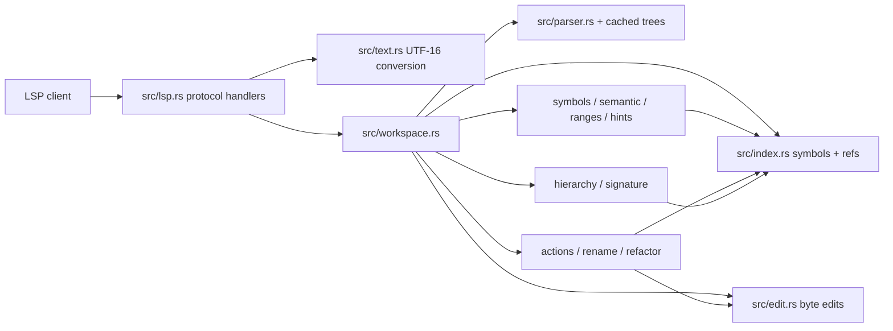

# feat: Expand LSP editor surface

## Overview

Expand ktlsp from a fast goto/references/completion server into a broader editor companion:
passive symbol intelligence, safe code actions, rename/refactoring support, navigation graph
features, signature help, range utilities, and operational commands.

The plan preserves the existing architecture: pure core modules operate on byte ranges and parsed
trees; `src/lsp.rs` remains the only `tower-lsp-server` / `ls-types` boundary; `src/text.rs`
remains the single UTF-16 conversion point. Features should silently omit uncertain results rather
than guess, matching the current completion and diagnostics contract.

## Problem Frame

The ideation pass found that ktlsp already has the hard substrate: incremental tree-sitter parsing,
symbol indexing, reverse references, completion shaping, member completion, auto-import insertion,
unused-import diagnostics, and opt-in compiler diagnostics. The missing value versus mature LSPs is
mostly editor surface area around those facts.

The work should therefore be staged as an LSP surface expansion, not as a new compiler or type
checker. The highest-value path is to expose conservative facts first, then use the same edit and
query infrastructure for code actions, rename, and refactorings.

## Requirements Trace

- R1. Add passive editor intelligence: hover, document symbols, workspace symbols, document
  highlights, semantic tokens, inlay hints, folding ranges, and selection ranges.
- R2. Add safe code actions for existing facts: remove unused import, remove all unused imports,
  organize imports, and add/import a known indexed symbol where the candidate is unambiguous.
- R3. Add a rename/refactoring spine: `prepareRename`, `rename`, and initial local structural
  refactorings built on exact byte edits.
- R4. Add navigation graph features: implementation, type definition, call hierarchy, and an
  incremental type hierarchy.
- R5. Add authoring support: signature help and richer completion resolve/detail for known
  declarations.
- R6. Keep compiler-free features conservative: if ktlsp cannot prove a fact, it should return no
  result rather than a misleading one.
- R7. Keep source edits safe and previewable through LSP `WorkspaceEdit`/`TextEdit`, never by
  mutating files directly in the server.
- R8. Preserve current performance posture: no new JVM/Gradle work on the request path, no lock held
  across `.await`, and pure-core tests for fast iteration.
- R9. Provide real-editor canaries for each protocol family, but keep detailed behavior coverage in
  pure fixture tests.

## Scope Boundaries

- This plan does not implement compiler-grade semantic diagnostics in Rust. The separate compiler
  diagnostics workstream remains authoritative for compile errors.
- This plan does not add bytecode decompilation for dependencies without sources.
- This plan does not add debug-adapter support.
- This plan does not add test runner code lenses until module-aware Gradle task mapping exists.
- This plan does not hand-roll a Kotlin formatter. Formatting, if added, delegates to ktfmt/ktlint
  behind explicit configuration and trust.
- This plan does not promise exhaustive Kotlin type modeling. Type hierarchy and signature help are
  best-effort projections over indexed declarations and existing inference.

## Context & Research

### Relevant Code and Patterns

- `src/lib.rs` documents and enforces the pure core versus LSP layer split.
- `src/lsp.rs` currently advertises definition, references, completion, text sync, save, progress,
  and compile diagnostics. It maps core byte ranges to LSP `Location`, `Diagnostic`, and
  `CompletionItem`.
- `src/text.rs` owns byte offset to LSP UTF-16 position conversion.
- `src/workspace.rs` owns open buffers, incremental parsing, project scanning, goto, completion,
  diagnostics, and references.
- `src/index.rs` stores project/library symbols and the reverse-reference index.
- `src/indexer.rs` extracts declarations and identifier usages from Kotlin ASTs, including
  recovery through `ERROR` nodes where safe.
- `src/complete.rs` already contains import insertion layout and candidate shaping that code
  actions should reuse instead of duplicating.
- `src/diagnostics.rs` currently emits only high-confidence unused-import diagnostics and suppresses
  diagnostics on non-clean parse trees.
- `tests/goto.rs`, `tests/references.rs`, `tests/completion.rs`, and `tests/diagnostics.rs` show the
  preferred pure fixture style.
- `tests/e2e.rs` is the wire canary for real `Backend` protocol behavior.

### Institutional Learnings

- No `docs/solutions/` directory is present in this worktree. Planning is grounded in local code,
  existing plans, and the ideation artifact.

### External References

- rust-analyzer feature set: https://rust-analyzer.github.io/book/features.html
- TypeScript language server source actions and commands:
  https://github.com/typescript-language-server/typescript-language-server
- gopls feature matrix: https://go.dev/gopls/features/
- clangd feature list: https://clangd.llvm.org/features

## Key Technical Decisions

- Build shared byte-edit infrastructure first. Code actions, rename, organize imports, and
  refactorings all need the same pure representation of file edits before `lsp.rs` converts them to
  LSP edits.
- Keep LSP types out of new core modules. New modules may return core DTOs such as byte ranges,
  symbol summaries, edits, hints, and hierarchy nodes; `src/lsp.rs` performs URI and UTF-16
  conversion.
- Add index iteration APIs instead of reaching into private maps. Workspace symbols, document
  symbols, semantic tokens, type hierarchy, and command diagnostics all need read-only views over
  indexed entries.
- Give diagnostics stable codes before code actions depend on them. Matching code actions by
  diagnostic message text would be fragile.
- Prefer small, conservative LSP methods over broad, clever ones. First versions should expose only
  facts ktlsp already knows: explicit declarations, indexed references, simple supertypes, and
  explicit/inferred types where the current inference returns a concrete type.
- Treat rename as stricter than references. References can cap pathological candidates; rename must
  either prove the full edit set or decline.
- Delegate formatting to external tools only after a trust/config story exists. AST folding and
  selection ranges should land independently because they do not need external execution.

## Open Questions

### Resolved During Planning

- Should this be planned as one feature or multiple independent plans? One roadmap plan is better
  because shared edit/symbol infrastructure materially affects every later item.
- Should passive features or refactorings go first? Passive features plus shared infrastructure go
  first; they exercise symbol/range APIs with lower edit risk before rename/refactorings depend on
  them.
- Should code actions reuse completion import insertion? Yes. Import layout and insertion already
  exist in the completion path, so the plan extracts or shares that logic rather than duplicating it.

### Deferred to Implementation

- Exact tree-sitter node kinds for selected refactorings and range features: verify with
  `examples/dump.rs` while implementing each unit, as prior plans require.
- Exact `ls-types` field names for newer protocol capabilities: confirm against the pinned
  `tower-lsp-server = "0.23"` API while coding.
- Formatter command discovery and configuration names: decide only when implementing formatter
  integration, after checking what ktfmt/ktlint invocation is available locally.

## High-Level Technical Design

> This illustrates the intended approach and is directional guidance for review, not implementation
> specification. The implementing agent should treat it as context, not code to reproduce.

The implementation should follow this dependency shape:

1. Add shared core DTOs and query APIs.
2. Expose read-only passive features.
3. Add safe edit-producing actions.
4. Add rename/refactorings on top of exact edit generation.
5. Add graph/signature features that need richer symbol relationships.
6. Add optional external-tool formatting and operational commands last.

## Implementation Units

- [x] **Unit 1: Shared symbol and edit foundations**

**Goal:** Create the reusable pure-core substrate for every new LSP surface: symbol summaries,
stable byte-range edits, and index iteration/query helpers.

**Requirements:** R1, R2, R3, R4, R5, R7, R8

**Dependencies:** None

**Files:**
- Create: `src/edit.rs`
- Create: `src/symbols.rs`
- Modify: `src/lib.rs`
- Modify: `src/index.rs`
- Modify: `src/workspace.rs`
- Test: `tests/edit.rs`
- Test: `tests/symbols.rs`

**Approach:**
- Add a pure edit DTO that represents file key, start byte, end byte, and replacement text.
- Add helpers in `src/lsp.rs` later to convert these byte edits to LSP `TextEdit` and
  `WorkspaceEdit`, but keep the DTO itself LSP-free.
- Add read-only `Index` iteration APIs for all entries, entries by file, top-level entries, members,
  and maybe refs by file/name. Keep existing private maps as the source of truth.
- Add a core symbol summary type for declaration kind, package, container, file, name range, value
  type, return type, params, type params, tier, and extension receiver when available.
- Add `Workspace` helper methods that resolve current text/tree from open buffer or disk without
  duplicating the open-buffer fallback in every new feature.
- Do not change existing goto/completion behavior in this unit.

**Patterns to follow:**
- `src/symbol.rs` for compact core data types.
- `src/text.rs` for pure conversion boundaries.
- `src/workspace.rs::goto_definition`, `Workspace::complete`, and `Workspace::references` for
  open-buffer precedence and parse-on-demand fallback.

**Test scenarios:**
- Happy path: byte edit conversion source range `val name = 1` replacing only `name` produces the
  expected changed text in a pure test helper.
- Edge case: two edits in the same file are sorted and detected as non-overlapping before conversion.
- Error path: overlapping edits are rejected or represented as invalid before any LSP conversion.
- Happy path: index iteration returns project and durable symbols without exposing mutable internals.
- Edge case: open-buffer symbols shadow disk contents when a file is dirty.

**Verification:**
- Existing goto, references, completion, and diagnostics tests still pass with no behavior change.
- New edit and symbol helpers are independently testable without async or LSP types.

- [x] **Unit 2: Passive symbol surface**

**Goal:** Add hover, document symbols, workspace symbols, and document highlights using existing
symbols, definitions, references, and parser facts.

**Requirements:** R1, R6, R8, R9

**Dependencies:** Unit 1

**Files:**
- Modify: `src/symbols.rs`
- Modify: `src/workspace.rs`
- Modify: `src/lsp.rs`
- Test: `tests/symbols.rs`
- Test: `tests/e2e.rs`

**Approach:**
- Implement document symbols from declarations extracted for one file. Use `SymbolKind` mapping in
  `lsp.rs`; core returns byte ranges and hierarchy/container facts.
- Implement workspace symbols by querying indexed entries with a prefix or substring policy chosen
  explicitly. Prefer simple case-insensitive contains only if it remains cheap and capped.
- Implement hover by resolving the symbol at cursor and formatting known facts: declaration kind,
  package/container, explicit return/value type, parameter count/list if indexed, and source tier.
  Return no hover for uncertain positions.
- Implement document highlights with same-file references to the resolved target. Use the existing
  reverse-reference machinery and filter to the current file.
- Advertise `hover_provider`, `document_symbol_provider`, `workspace_symbol_provider`, and
  `document_highlight_provider` only once handlers exist.

**Patterns to follow:**
- `src/lsp.rs::goto_definition` for request tracing, lock scope, URI conversion, and empty result
  behavior.
- `tests/references.rs` for homonym/shadowing precision.
- `src/complete.rs::detail` for concise declaration presentation.

**Test scenarios:**
- Happy path: document symbols for a file with package, class, member function, top-level function,
  and property return all expected names and kinds.
- Edge case: document symbols in a file with parse `ERROR` recover safe declarations but do not
  fabricate ranges for broken nodes.
- Happy path: workspace symbol query `Help` returns project symbols before durable symbols when both
  match.
- Edge case: workspace symbol query with empty or very broad text is capped deterministically.
- Happy path: hover on `helper()` shows the top-level function's kind and package.
- Edge case: hover on whitespace or an unresolved identifier returns no result.
- Happy path: document highlights on a local variable include only same-file usages of that exact
  binding, excluding shadowed homonyms.
- Integration: `tests/e2e.rs` initializes the server and confirms the new capabilities are
  advertised and at least one hover/document-symbol request succeeds.

**Verification:**
- Passive requests do not spawn external processes.
- Empty or uncertain positions return `None`/empty results rather than guessed data.

- [x] **Unit 3: Semantic tokens, inlay hints, folding, and selection ranges**

**Goal:** Add read-only visual/editor features that project parser, symbol, and inference facts into
standard LSP requests.

**Requirements:** R1, R5, R6, R8, R9

**Dependencies:** Unit 1, partially Unit 2 for shared symbol formatting

**Files:**
- Create: `src/semantic.rs`
- Create: `src/hints.rs`
- Create: `src/ranges.rs`
- Modify: `src/lib.rs`
- Modify: `src/workspace.rs`
- Modify: `src/lsp.rs`
- Test: `tests/semantic.rs`
- Test: `tests/inlay_hints.rs`
- Test: `tests/ranges.rs`
- Test: `tests/e2e.rs`

**Approach:**
- Semantic tokens: classify declarations and obvious usages from tree-sitter nodes and symbol kind.
  Keep the first token legend small and stable: namespace/package, class/interface/object/enum,
  function, property/variable, parameter, type parameter, enum entry, keyword if useful.
- Inlay hints: start with type hints for local `val`/`var` and function returns only when the
  existing inference/type extraction returns a concrete type. Avoid parameter-name hints until
  argument-to-parameter mapping is reliable.
- Folding ranges: derive ranges for class/object/interface bodies, function bodies, blocks, import
  groups, and comments where tree-sitter nodes have stable spans.
- Selection ranges: walk the AST parent chain from cursor leaf to root and return ranges that
  strictly expand.
- Add request tracing names for new methods where useful.

**Patterns to follow:**
- `src/parser.rs` node-kind comments and `examples/dump.rs` verification discipline.
- `src/infer.rs` and `src/types.rs` for `Unknown` as a non-error outcome.
- `src/lsp.rs::to_lsp_diagnostic` and `def_to_location` for byte-range conversion.

**Test scenarios:**
- Happy path: semantic tokens classify `class Box`, `fun open`, `val item`, and a parameter with
  expected token kinds.
- Edge case: semantic tokens for a syntactically broken file skip uncertain regions or return only
  ranges with stable node spans.
- Happy path: `val box = Box()` gets a type inlay hint for `Box` when inference can prove it.
- Edge case: an unannotated expression whose type is `Unknown` produces no inlay hint.
- Happy path: folding ranges include a class body and function body with stable line ranges.
- Edge case: single-line declarations do not produce useless one-line folds.
- Happy path: selection ranges from inside `helper(arg)` expand from identifier to call expression
  to enclosing block/function.
- Integration: e2e initializes with relevant client capabilities and verifies at least one semantic
  token, inlay hint, and folding/selection response.

**Verification:**
- The server advertises each capability only when the handler is wired.
- All ranges convert through `LineIndex`; no core module imports LSP types.

- [x] **Unit 4: Import-aware code actions**

**Goal:** Add code actions and source actions for unused imports and known import insertion.

**Requirements:** R2, R6, R7, R8, R9

**Dependencies:** Unit 1

**Files:**
- Create: `src/actions.rs`
- Create: `src/imports.rs`
- Modify: `src/complete.rs`
- Modify: `src/diagnostics.rs`
- Modify: `src/workspace.rs`
- Modify: `src/lsp.rs`
- Test: `tests/code_actions.rs`
- Test: `tests/diagnostics.rs`
- Test: `tests/completion.rs`
- Test: `tests/e2e.rs`

**Approach:**
- Extract import layout/insertion helpers currently used by completion into a pure import module so
  completion and code actions share sorting, anchor, and newline behavior.
- Add stable diagnostic codes to `src/diagnostics.rs`, beginning with `unused_import`. Map them to
  LSP `Diagnostic.code` in `src/lsp.rs`.
- Implement `textDocument/codeAction` for:
  - remove this unused import
  - remove all unused imports in this file
  - organize imports in this file
  - add import for an unambiguous indexed symbol at cursor or diagnostic range
- Implement source actions such as `source.organizeImports` and `source.fixAll.ktlsp` only for
  edits the core can prove.
- Return `CodeAction` with `WorkspaceEdit`; do not execute edits server-side.

**Patterns to follow:**
- `src/diagnostics.rs` false-positive avoidance.
- `src/complete.rs` auto-import edit generation.
- `tests/diagnostics.rs` for import-specific fixture coverage.

**Test scenarios:**
- Happy path: code action on `import a.b.Unused` returns a single edit removing that import and its
  trailing newline cleanly.
- Happy path: "remove all unused imports" removes two unused imports while preserving a used import.
- Edge case: wildcard import is never offered as an unused-import removal.
- Edge case: aliased import removal uses the alias diagnostic code/range and deletes the whole
  import line.
- Happy path: organize imports sorts imports alphabetically below the package line and preserves the
  package declaration.
- Edge case: organize imports preserves comments or declines when comments are interleaved in a way
  the import sorter cannot safely rewrite.
- Happy path: add-import action for `HelperXyz` inserts `import lib.HelperXyz` at the same line that
  completion would use.
- Error path: add-import action is not offered when two indexed symbols with the same simple name
  are equally plausible.
- Integration: e2e confirms `code_action_provider` is advertised and a remove-unused-import action
  round-trips as an LSP edit.

**Verification:**
- Completion auto-import behavior remains unchanged because both paths use shared import helpers.
- Code actions are absent for uncertain parse states or ambiguous import candidates.

- [ ] **Unit 5: Rename and first refactorings**

**Goal:** Add exact rename support and an initial set of structural refactorings that produce safe
byte edits.

**Requirements:** R3, R6, R7, R8, R9

**Dependencies:** Unit 1, Unit 4 for shared edit conversion

**Files:**
- Create: `src/rename.rs`
- Create: `src/refactor.rs`
- Modify: `src/workspace.rs`
- Modify: `src/lsp.rs`
- Test: `tests/rename.rs`
- Test: `tests/refactor.rs`
- Test: `tests/references.rs`
- Test: `tests/e2e.rs`

**Approach:**
- Implement `prepareRename` first. It should return a range only for identifiers that ktlsp can
  resolve to a project/local declaration. Decline library symbols, unresolved identifiers, keywords,
  and non-identifiers.
- Implement `rename` by collecting all exact references to the target and producing byte edits for
  the identifier ranges. Do not use the references cap for rename; if complete candidate collection
  cannot be proven, decline the rename.
- Validate new names with a Kotlin identifier check before producing edits.
- Start refactorings as code actions that operate on the current file only:
  - introduce local variable for a selected expression
  - inline local variable when the initializer and usages are safe
  - convert expression body to block body
  - convert simple block body to expression body
- Treat extract function and move declaration as later extensions after the edit engine and range
  selection are proven.

**Patterns to follow:**
- `Workspace::references` for exact target filtering through re-resolution.
- `src/parser.rs::identifier_at` for cursor/range identification.
- `tests/references.rs::references_distinguishes_shadowed_homonyms` for the precision bar.

**Test scenarios:**
- Happy path: rename top-level function changes declaration and all call sites across two project
  files.
- Happy path: rename local variable changes only the local declaration and exact usages in scope.
- Edge case: rename excludes shadowed homonyms in nested or sibling scopes.
- Error path: rename on whitespace, keyword, unresolved identifier, or library symbol is declined.
- Error path: invalid new name such as `1bad` or a keyword is rejected before edit generation.
- Happy path: prepareRename returns the identifier range for a function declaration and usage.
- Happy path: introduce local variable wraps a selected expression in a preceding `val` and replaces
  the selected expression with the new name in simple block context.
- Edge case: introduce local variable is not offered when the selection spans partial tokens or
  crosses declarations.
- Happy path: expression-body/block-body conversion preserves return expression text for simple
  single-expression functions.
- Integration: e2e confirms `rename_provider` is advertised and a basic rename returns a
  `WorkspaceEdit`.

**Verification:**
- Rename never edits a file outside the project reverse-reference index.
- Refactor code actions are absent unless their AST preconditions are met.

- [ ] **Unit 6: Navigation graph features**

**Goal:** Add implementation/type-definition navigation and hierarchy requests using indexed
relationships and references.

**Requirements:** R4, R6, R8, R9

**Dependencies:** Unit 1, Unit 2

**Files:**
- Create: `src/hierarchy.rs`
- Modify: `src/index.rs`
- Modify: `src/indexer.rs`
- Modify: `src/workspace.rs`
- Modify: `src/lsp.rs`
- Test: `tests/hierarchy.rs`
- Test: `tests/goto.rs`
- Test: `tests/e2e.rs`

**Approach:**
- Implement `textDocument/implementation` for interface/class symbols by finding type-like entries
  whose indexed supertypes include the target type. Package-filter where known.
- Implement `textDocument/typeDefinition` for expressions only when existing inference yields a
  concrete `Type`; map that type to indexed type declarations.
- Implement call hierarchy in two passes:
  - prepare on resolvable function/property symbols
  - incoming calls from reference sites that are syntactically inside call expressions or callable
    references
  - outgoing calls by walking the prepared symbol's body and resolving call-like identifiers
- Implement type hierarchy after implementation navigation is stable, using direct supertypes and
  direct subtypes first.
- Keep hierarchy depth incremental; clients can request more levels through the protocol.

**Patterns to follow:**
- `src/index.rs::supertypes_of_in`, `members_of`, and `extensions_for`.
- `src/resolve.rs::use_kind` for call/type/value context.
- `src/workspace.rs::collect_refs_in_file` for grouped file parsing.

**Test scenarios:**
- Happy path: implementation on `interface Greeter` returns `class ConsoleGreeter : Greeter`.
- Edge case: implementation does not return a same-simple-name subtype from a different package
  when package information disambiguates the target.
- Happy path: typeDefinition on `val g = GreeterImpl()` usage returns the `GreeterImpl` class.
- Edge case: typeDefinition returns no result when inference returns `Unknown`.
- Happy path: call hierarchy incoming calls for `helper` include functions that call `helper()`.
- Edge case: call hierarchy excludes non-call references such as type annotations or property names
  with the same identifier.
- Happy path: type hierarchy supertypes/subtypes return direct neighbors only for v1.
- Integration: e2e confirms capabilities for implementation, type definition, and hierarchy
  prepare requests.

**Verification:**
- Navigation graph features do not change existing goto/reference semantics.
- Ambiguous package/type relationships produce no result or multiple explicit results, never a
  fabricated single target.

- [ ] **Unit 7: Signature help and completion resolve**

**Goal:** Add call-site signature help and optional completion item resolution using explicit
declaration signatures already present in the index.

**Requirements:** R5, R6, R8, R9

**Dependencies:** Unit 1, Unit 2

**Files:**
- Create: `src/signature.rs`
- Modify: `src/complete.rs`
- Modify: `src/symbol.rs`
- Modify: `src/indexer.rs`
- Modify: `src/workspace.rs`
- Modify: `src/lsp.rs`
- Test: `tests/signature.rs`
- Test: `tests/completion.rs`
- Test: `tests/e2e.rs`

**Approach:**
- Use indexed `params`, `return_type`, `type_params`, `container`, package, and extension receiver
  to format signature labels.
- Locate the active call expression from cursor position and count top-level commas to choose
  `activeParameter` when safe.
- If overload resolution is ambiguous, return multiple candidate signatures and avoid claiming a
  single chosen overload unless existing resolution proves one.
- Set completion `resolve_provider` only after items carry enough stable data to look up the full
  symbol without relying on labels alone. If the initial completion detail is already sufficient,
  keep resolve minimal.
- Do not add inferred or compiler-only signatures in v1.

**Patterns to follow:**
- `src/indexer.rs` parameter and return-type extraction.
- `src/complete.rs::detail` and shaped completion item flow.
- `src/infer.rs` for conservative type outcomes.

**Test scenarios:**
- Happy path: signature help inside `add(1, 2)` returns `add(a: Int, b: Int): Int` from an explicit
  declaration.
- Happy path: active parameter is 0 before the first comma and 1 after the first top-level comma.
- Edge case: nested calls inside arguments do not increment the outer active parameter.
- Edge case: unresolved function name returns no signature help.
- Happy path: overloads with the same name return multiple signatures when ktlsp cannot choose one.
- Happy path: completion resolve enriches a function item with parameter and return details when
  the candidate can be uniquely identified.
- Error path: completion resolve leaves the item unchanged when the symbol identity is stale or
  ambiguous.
- Integration: e2e confirms `signature_help_provider` is advertised and a basic request returns a
  signature.

**Verification:**
- Signature help never requires running Gradle or the Kotlin compiler.
- Completion remains fast and capped.

- [ ] **Unit 8: Formatting, commands, documentation, and editor canaries**

**Goal:** Add the remaining operational polish: optional external formatting, workspace commands,
documented settings, and real-editor smoke coverage for the expanded LSP surface.

**Requirements:** R6, R7, R8, R9

**Dependencies:** Units 1 through 7 for most commands; folding/selection from Unit 3 can land before
formatting.

**Files:**
- Create: `src/commands.rs`
- Create: `src/format.rs`
- Modify: `src/lsp.rs`
- Modify: `src/workspace.rs`
- Modify: `README.md`
- Modify: `dev/nvim_features.lua`
- Modify: `dev/smoke_features.sh`
- Test: `tests/commands.rs`
- Test: `tests/formatting.rs`
- Test: `tests/e2e.rs`

**Approach:**
- Add `workspace/executeCommand` support for commands that inspect or reset ktlsp state:
  - reindex workspace
  - clear/rebuild library cache where safe
  - explain resolution at cursor
  - dump symbol at cursor
  - open or report trace log path
- Keep destructive/cache-clearing commands explicit and documented. Avoid deleting anything outside
  ktlsp-owned cache paths.
- Add document/range formatting only through a configured external formatter. Apply the same trust
  posture as compile diagnostics before running project-local tools.
- Document all initialization options and capability expectations in `README.md`.
- Expand `dev/nvim_features.lua` and `dev/smoke_features.sh` to cover a small representative set:
  hover, document symbols, code action, rename, signature help, and one range feature.

**Patterns to follow:**
- `src/trust.rs` and compile diagnostics trust prompt for external execution.
- `src/trace.rs` for trace path behavior and best-effort operational diagnostics.
- Existing Neovim smoke scripts under `dev/`.

**Test scenarios:**
- Happy path: explain-resolution command returns the resolved definition file/range and candidate
  reason for a simple function call.
- Edge case: explain-resolution on unresolved input returns a structured "no result" explanation
  rather than an error.
- Happy path: trace-path command returns the active trace path without creating unrelated files.
- Error path: clear-cache command refuses paths outside ktlsp cache ownership.
- Happy path: formatting with a configured formatter returns a full-document edit when the formatter
  exits successfully.
- Error path: formatting returns no edits and logs a message when the formatter is unavailable,
  untrusted, or exits non-zero.
- Integration: e2e confirms `execute_command_provider` and formatting providers are advertised only
  when supported by configuration.

**Verification:**
- README examples match actual initialization option names.
- Smoke scripts exercise the new protocol surface without requiring network access.

## System-Wide Impact

- **Interaction graph:** `src/lsp.rs` gains many request handlers, but all new work should route
  through `Workspace` and pure modules. Existing goto/references/completion handlers should remain
  behaviorally unchanged.
- **Error propagation:** Pure modules should return empty/declined results for uncertainty. LSP
  handlers should map unsupported/uncertain cases to `None`, empty arrays, or absent code actions
  rather than JSON-RPC errors.
- **State lifecycle risks:** Rename/code actions must compute edits against the current open-buffer
  text, not stale disk text. Workspace helpers added in Unit 1 are intended to centralize that.
- **Cache risks:** New index fields that become serialized in `IndexedSymbol` require a symcache
  version bump in `src/deps.rs`, following existing comments in the autocomplete plans.
- **Performance risks:** Workspace symbols, semantic tokens, and hierarchy can become broad scans.
  They need caps and deterministic ordering, and expensive work should happen outside async awaits
  while preserving current lock discipline.
- **API surface parity:** Capabilities advertised in `initialize` must match implemented handlers.
  Real-editor tests should catch accidental over-advertising.
- **Unchanged invariants:** No new feature should run Gradle/JVM work unless it is explicitly part
  of the existing opt-in compile diagnostics or future trusted formatter path.

## Risks & Dependencies

| Risk | Mitigation |
|------|------------|
| Rename edits the wrong symbol | Build on exact re-resolution, exclude ambiguous/library symbols, and add shadowing tests before broadening scope. |
| Code actions corrupt import layout | Extract one shared import helper and cover aliases, wildcard imports, package headers, comments, and blank lines. |
| Passive features become noisy | Start with conservative symbols and omit uncertain data; do not infer beyond existing `Type::Unknown` boundaries. |
| LSP layer grows too complex | Keep each feature's core logic in a module and reserve `src/lsp.rs` for conversion, capability advertisement, and tracing. |
| Workspace-wide scans hurt latency | Add caps, deterministic ordering, and trace events; avoid new per-keystroke full-workspace passes. |
| New serialized symbol fields break old caches | Bump `SYMCACHE_VERSION` whenever `IndexedSymbol` serialized layout changes. |
| External formatter creates trust/security issues | Gate external execution behind explicit configuration and trust, mirroring compile diagnostics. |

## Documentation / Operational Notes

- Update `README.md` status: the current README still says hover, completion, and rename are out of
  scope, but completion already exists and this plan adds the rest incrementally.
- Document capability support in a table: available, conservative/partial, and intentionally out of
  scope.
- Document all initialization options once commands/formatting settings exist.
- Keep `dev/nvim_features.lua` as the high-signal real-editor canary for the expanded surface.

## Phased Delivery

### Phase 1: Low-risk read-only surface

- Unit 1: Shared symbol and edit foundations
- Unit 2: Passive symbol surface
- Unit 3: Semantic tokens, inlay hints, folding, and selection ranges

### Phase 2: Safe edits

- Unit 4: Import-aware code actions
- Unit 5: Rename and first refactorings

### Phase 3: Power-user navigation and authoring

- Unit 6: Navigation graph features
- Unit 7: Signature help and completion resolve

### Phase 4: Operational polish

- Unit 8: Formatting, commands, documentation, and editor canaries

## Alternative Approaches Considered

- **Build refactorings first:** Rejected because rename/refactoring needs a shared edit substrate and
  exact symbol query helpers. Passive features prove those APIs with lower risk.
- **Implement each LSP feature directly in `src/lsp.rs`:** Rejected because it violates the existing
  core/LSP split and would make pure tests harder.
- **Use compiler APIs for all rich features:** Rejected for this roadmap. ktlsp's value proposition
  is fast compiler-free editor help, with compiler diagnostics remaining opt-in.
- **Skip code actions until compiler diagnostics are complete:** Rejected because unused-import and
  import insertion actions are already supported by existing compiler-free facts.

## Sources & References

- Origin document: `docs/ideation/2026-06-29-lsp-bells-and-whistles-ideation.md`
- Local code: `src/lsp.rs`, `src/workspace.rs`, `src/index.rs`, `src/indexer.rs`,
  `src/complete.rs`, `src/diagnostics.rs`, `src/text.rs`, `src/trace.rs`
- Existing tests: `tests/e2e.rs`, `tests/goto.rs`, `tests/references.rs`,
  `tests/completion.rs`, `tests/diagnostics.rs`
- Existing plans: `docs/plans/autocomplete-stage-c.md`,
  `docs/plans/2026-06-05-001-feat-gradual-type-checker-plan.md`
- External docs: https://rust-analyzer.github.io/book/features.html
- External docs: https://github.com/typescript-language-server/typescript-language-server
- External docs: https://go.dev/gopls/features/
- External docs: https://clangd.llvm.org/features
