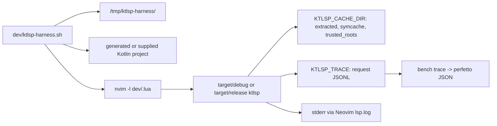

# feat: Scriptable editor harness and debug runs

## Overview

ktlsp already has strong core tests and several headless Neovim smoke scripts, but it lacks one
agent-friendly harness that can create or accept a Kotlin project, start a real editor LSP client,
exercise ktlsp, and collect enough logs/trace data to diagnose failures. This plan keeps the current
Neovim path, adds a thin scenario runner with deterministic run artifacts under `/tmp`, and adds the
small debug/cache plumbing needed so agents can run ktlsp without writing into a protected home cache.

## Current Status

- `cargo test` passes: 337 passing tests, 3 intentionally ignored.
- `dev/smoke.sh` passes against `dev/sample` for filetype detection, initialize, local goto, and
  cross-file goto.
- `dev/smoke_features.sh` passes with `XDG_STATE_HOME` and `KTLSP_TRACE` redirected to `/tmp`, covering
  references, completion, auto-import, member goto, and did-change reparse.
- `dev/smoke_library.sh` fails in the default sandbox because ktlsp tries to extract sources into
  `~/.cache/ktlsp/extracted` and gets `Operation not permitted`. The same smoke passes when `HOME`
  points at a writable temp dir with symlinks back to the real `.gradle`/`.m2` caches and Cargo keeps
  using the real `CARGO_HOME`.
- Existing observability is useful but scattered: `RUST_LOG=ktlsp=debug` logs to stderr, `KTLSP_TRACE`
  writes request JSONL, `KTLSP_COMPILE_LOG` writes compile timing JSONL, and `bench trace` converts
  trace JSONL to Perfetto/Chrome trace JSON.
- `dev/nvim_gradle_live.lua` and `dev/nvim_comprehensive.lua` hardcode a specific checkout path,
  so they do not naturally exercise this worktree.

## Problem Frame

The missing capability is not another unit-test layer. The useful harness needs to drive ktlsp the way
an editor does: spawn the stdio LSP binary from Neovim, open buffers, request definitions/completions,
observe diagnostics, and leave behind artifacts an agent can inspect after a failure. It also needs to
work from a temporary project root because many interesting probes are disposable fixtures, not files
that should live permanently in the repo.

## Requirements Trace

- R1. Provide one scriptable entrypoint that starts a real headless editor LSP client against ktlsp.
- R2. Let the harness create disposable Kotlin projects under `/tmp` and also accept an existing
  project root.
- R3. Preserve the existing smoke coverage: initialization, capabilities, goto, references,
  completion, auto-import, library-source goto, and optional compile diagnostics.
- R4. Add a debug launch mode that writes all relevant artifacts to one run directory: harness log,
  Neovim logs, ktlsp stderr/log output, request trace JSONL, Perfetto trace JSON, compile timing JSONL,
  and cache/trust files.
- R5. Decouple ktlsp's writable cache root from `HOME` so agents can read real Gradle/Maven caches but
  write ktlsp extraction/symcache/trust artifacts into a temp run directory.
- R6. Fix hardcoded dev scripts so every smoke runs against the current worktree unless a project/bin
  is explicitly supplied.

## Scope Boundaries

- Do not replace the Rust core tests or the existing benchmark/oracle harness.
- Do not make compile diagnostics mandatory in normal smoke runs; they remain opt-in because Gradle
  and the Kotlin daemon are slow/heavy compared with goto/completion checks.
- Do not introduce a new editor dependency. Headless Neovim is already present and already exercises
  the real LSP client path.
- Do not turn this into CI gating in the first pass. The first goal is a dependable local/agent
  harness; CI can select stable scenarios later.

## Context & Research

### Relevant Code and Patterns

- `dev/smoke.sh`, `dev/smoke_features.sh`, `dev/smoke_library.sh` already provide thin
  build-then-run shell entrypoints.
- `dev/nvim_smoke.lua`, `dev/nvim_features.lua`, and `dev/nvim_library.lua` already drive Neovim's
  built-in LSP client over stdio and are the right pattern to reuse.
- `src/main.rs` already keeps stdout clean for JSON-RPC and sends tracing logs to stderr.
- `src/trace.rs` records per-request JSONL with method, file, cursor, symbol, outcome, count, and
  duration. `src/bin/bench.rs trace` converts that JSONL to a Perfetto-loadable trace JSON file.
- `src/telemetry.rs` records compile timing JSONL; `src/bin/bench.rs analyze` summarizes it.
- `src/deps.rs::cache_home` and `src/trust.rs` currently tie extraction, symcache, and trust storage
  to `HOME/.cache/ktlsp`, which caused the library smoke failure in the sandbox.

### Institutional Learnings

- No `docs/solutions/` directory exists in this repo.
- `docs/plans/2026-06-08-001-feat-diagnostics-backend-bench-harness-plan.md` establishes the
  existing separation: backend latency/oracle lives in `bench`, while editor correctness belongs
  in Neovim-based smoke tests.

## Key Technical Decisions

- **Use headless Neovim as the editor harness.** It already exists, is scriptable, and exercises the
  real LSP client rather than a hand-rolled JSON-RPC driver.
- **Add a wrapper, not a second framework.** A new `dev/ktlsp-harness.sh` should manage project
  creation, debug env, run directories, and scenario selection while reusing or lightly adapting the
  existing Lua probes.
- **Make every debug run artifact-backed.** Each run gets `/tmp/ktlsp-harness/<timestamp-or-id>/`
  with logs, traces, temp HOME/cache, generated projects, and a short summary.
- **Introduce `KTLSP_CACHE_DIR`.** ktlsp should use this for extracted sources, symcache, trusted
  roots, and default trace/compile logs. `HOME` remains available for locating existing `.gradle` and
  `.m2` caches.
- **Keep heavy diagnostics scenarios opt-in.** Basic, feature, and library smokes should stay fast.
  Compile diagnostics should run only with an explicit scenario or flag.

## Open Questions

### Resolved During Planning

- **Which editor?** Headless Neovim, because it is already used and available locally.
- **Where do artifacts go?** A per-run directory under `/tmp/ktlsp-harness/`.
- **Is library goto broken?** No. It passed after redirecting ktlsp's writable cache to `/tmp`; the
  default failure is environment/cache coupling.

### Deferred to Implementation

- **Exact harness CLI shape.** Start with scenario subcommands such as `basic`, `features`,
  `library`, `gradle-live`, and `comprehensive`; refine names while implementing.
- **Whether to add `ktlsp --debug-dir <dir>` in addition to env vars.** Useful, but the minimum viable
  path is `KTLSP_CACHE_DIR`, `KTLSP_TRACE`, `KTLSP_COMPILE_LOG`, and `RUST_LOG` set by the harness.

## High-Level Technical Design

> *This illustrates the intended approach and is directional guidance for review, not implementation
> specification. The implementing agent should treat it as context, not code to reproduce.*

## Implementation Units

- [x] **Unit 1: Decouple ktlsp cache/debug destinations from HOME**

**Goal:** Let the harness choose a writable ktlsp cache/log root without hiding the user's real
Gradle/Maven/Cargo caches.

**Requirements:** R4, R5

**Dependencies:** None

**Files:**
- Modify: `src/deps.rs`
- Modify: `src/trace.rs`
- Modify: `src/telemetry.rs`
- Modify: `README.md`
- Test: inline unit tests in `src/deps.rs`, `src/trace.rs`, and `src/telemetry.rs`

**Approach:**
- Add `KTLSP_CACHE_DIR` as the first-choice ktlsp cache root.
- Keep `HOME/.cache/ktlsp` as the default when `KTLSP_CACHE_DIR` is unset.
- Keep `KTLSP_TRACE` and `KTLSP_COMPILE_LOG` as explicit file overrides; otherwise default them under
  the ktlsp cache root.
- Do not change artifact lookup for local Gradle/Maven caches in `src/artifacts.rs`; those should
  still use the real `HOME` unless the harness intentionally provides a temp home with symlinks.

**Patterns to follow:**
- Existing env-first behavior in `src/trace.rs::log_path` and `src/telemetry.rs::log_path`.
- Existing `src/deps.rs::cache_home` as the single root for extraction, symcache, and trust.

**Test scenarios:**
- Happy path: `KTLSP_CACHE_DIR=/tmp/run/cache` makes `deps::cache_home()` return that path.
- Happy path: with `KTLSP_CACHE_DIR` set and no `KTLSP_TRACE`, trace defaults to
  `/tmp/run/cache/trace-events.jsonl`.
- Happy path: explicit `KTLSP_TRACE` and `KTLSP_COMPILE_LOG` still win over the cache root.
- Edge case: empty `KTLSP_CACHE_DIR` is ignored and falls back to the existing default.

**Verification:** Library-source extraction and trace/telemetry writes can be directed to a temp run
directory without changing `HOME`.

- [x] **Unit 2: Add a unified harness wrapper**

**Goal:** Provide a single scriptable command that creates a run directory, sets debug env, selects a
scenario, runs Neovim headlessly, and prints artifact paths.

**Requirements:** R1, R2, R3, R4

**Dependencies:** Unit 1 for clean cache redirection; can initially work around with temp `HOME`.

**Files:**
- Create: `dev/ktlsp-harness.sh`
- Modify: `.gitignore` only if a local non-`/tmp` artifact fallback is added

**Approach:**
- Resolve repo root and binary path from the script location.
- Create `/tmp/ktlsp-harness/<run-id>/` with subdirs for `home`, `cache`, `xdg-state`, `projects`,
  and `artifacts`.
- Set `RUST_LOG=ktlsp=debug`, `KTLSP_CACHE_DIR`, `KTLSP_TRACE`, `KTLSP_COMPILE_LOG`, and
  `XDG_STATE_HOME` for every run.
- Keep `CARGO_HOME`/`RUSTUP_HOME` pointed at the real user caches when `HOME` is redirected, avoiding
  accidental crates.io access.
- For scenarios that need dependency sources, either use the real `HOME` once Unit 1 lands or create
  temp-home symlinks to `.gradle`/`.m2`.
- Capture harness stdout/stderr to an artifact log and convert request JSONL to Perfetto JSON when
  trace events exist.

**Patterns to follow:**
- Thin build-then-run structure from `dev/smoke.sh`.
- `bench trace` and `bench analyze` subcommands in `src/bin/bench.rs`.

**Test scenarios:**
- Happy path: `dev/ktlsp-harness.sh basic` creates a temp two-file Kotlin project and passes local
  and cross-file goto.
- Happy path: `dev/ktlsp-harness.sh features` passes existing feature smoke coverage.
- Happy path: `dev/ktlsp-harness.sh library` passes library goto with all ktlsp writes under the run
  directory.
- Edge case: a failing scenario still prints the run directory and leaves logs/traces for inspection.
- Error path: no `nvim` on `PATH` produces a clear harness error before building/running ktlsp.

**Verification:** After each run, the repo has no `nvim.log` or other generated files, and the run
directory contains Neovim logs plus ktlsp trace artifacts.

- [x] **Unit 3: Make Neovim probes worktree-relative and project-parameterized**

**Goal:** Ensure every existing editor probe can run against this worktree or a supplied project
instead of a hardcoded checkout.

**Requirements:** R2, R3, R6

**Dependencies:** None

**Files:**
- Modify: `dev/nvim_smoke.lua`
- Modify: `dev/nvim_gradle_live.lua`
- Modify: `dev/nvim_comprehensive.lua`
- Modify: `dev/smoke.sh`, `dev/smoke_features.sh`, `dev/smoke_library.sh` only if needed to route
  through the new wrapper while preserving old commands.

**Approach:**
- Derive repo root from `debug.getinfo(1, "S").source` as `dev/init.lua` already does.
- Accept optional argv values for project root, binary path, and scenario-specific probe file.
- Keep existing defaults so current direct commands still work.
- Remove hardcoded absolute paths from `dev/nvim_gradle_live.lua` and `dev/nvim_comprehensive.lua`.

**Patterns to follow:**
- `dev/init.lua` repo/bin discovery.
- `dev/nvim_features.lua` and `dev/nvim_library.lua` already accepting project roots via `arg[1]`.

**Test scenarios:**
- Happy path: direct `nvim -l dev/nvim_smoke.lua <tmp-project>` works on a generated basic project.
- Happy path: `dev/nvim_gradle_live.lua` runs against the current worktree's `dev/gradle-sample`.
- Edge case: omitted args preserve the current sample defaults.

**Verification:** No Neovim probe contains an absolute checkout path after the change.

- [x] **Unit 4: Add disposable project scenarios**

**Goal:** Let the harness start ktlsp on temporary Kotlin projects without relying only on committed
fixtures.

**Requirements:** R2, R3

**Dependencies:** Unit 2, Unit 3

**Files:**
- Modify: `dev/ktlsp-harness.sh`
- Optionally create: `dev/nvim_probe.lua` if adapting existing Lua probes becomes more complex than
  a small generic probe driver.

**Approach:**
- `basic` scenario creates a temp project with `Main.kt` and `Greeter.kt` matching the smoke probe's
  expectations.
- `library` scenario creates a temp Gradle-like project with `gradle/libs.versions.toml` declaring
  kotlin-stdlib and a `Main.kt` with `listOf`.
- `project` scenario accepts `--root <dir>` and `--file <file>` for ad hoc manual probes; start with
  capability and initialization checks, then add optional requested probes later.
- Keep project generation deterministic and disposable under the run directory.

**Patterns to follow:**
- Temp library project generation in `dev/smoke_library.sh`.
- Existing `dev/sample` source shape.

**Test scenarios:**
- Happy path: generated `basic` project resolves local and cross-file definitions.
- Happy path: generated `library` project resolves `listOf` into extracted stdlib sources.
- Edge case: project path containing spaces still opens and resolves.

**Verification:** A harness run can exercise ktlsp against a project that did not exist before the
command started.

- [x] **Unit 5: Document the harness and debug workflow**

**Goal:** Make the harness discoverable and make failure triage repeatable.

**Requirements:** R1, R4, R5

**Dependencies:** Units 1-4

**Files:**
- Modify: `README.md`
- Optionally create: `docs/harness.md` if the README section becomes too large

**Approach:**
- Document the minimal commands for `basic`, `features`, `library`, and compile diagnostics.
- List every artifact path produced in a run directory and what each answers.
- Explain the env vars: `RUST_LOG`, `KTLSP_CACHE_DIR`, `KTLSP_TRACE`, `KTLSP_COMPILE_LOG`,
  `KTLSP_SIDECAR_BIN`, and the reason `CARGO_HOME` may need to remain real when `HOME` is temp.
- Include a short troubleshooting table for empty goto results, dependency extraction failures,
  missing sidecar, and Neovim log path failures.

**Patterns to follow:**
- Existing README "Development" and "Real-editor smoke test" sections.

**Test scenarios:** Documentation-only unit; verify commands in the doc were run during final
verification.

**Verification:** A new agent can run one command, get a pass/fail result, and know which files to
inspect when it fails.

## System-Wide Impact

- **Interaction graph:** The harness invokes the shipping `ktlsp` binary through Neovim over stdio.
  No production LSP behavior changes except cache/debug destination plumbing.
- **Error propagation:** A failed probe should return non-zero while preserving artifacts. The wrapper
  must not hide Neovim/LSP failures behind successful cleanup.
- **State lifecycle risks:** Temp projects and caches should live under the run directory. Repo root
  must remain clean after harness runs.
- **API surface parity:** `KTLSP_CACHE_DIR` becomes a developer-facing environment variable and must
  be documented. Existing `KTLSP_TRACE` and `KTLSP_COMPILE_LOG` behavior must remain compatible.
- **Integration coverage:** Fast scenarios prove editor/LSP behavior; compile diagnostics remain a
  separate opt-in scenario because they cross into Gradle/sidecar behavior and have different timing
  characteristics.

## Risks & Dependencies

| Risk | Mitigation |
|------|------------|
| Redirecting `HOME` breaks Cargo or Rustup and causes network access | Prefer `KTLSP_CACHE_DIR`; when a temp `HOME` is still needed, preserve `CARGO_HOME` and `RUSTUP_HOME` |
| Harness duplicates too much existing Lua logic | Reuse/adapt existing probes first; create a generic probe only if it removes complexity |
| Debug logs corrupt JSON-RPC stdout | Keep all logs on stderr/Neovim logs; do not write human output from ktlsp to stdout |
| Library smoke depends on network | Use local Gradle/Maven caches when present; report a clear skipped/failure reason when sources are absent |
| Compile diagnostics scenario is slow or prompts for trust | Keep it opt-in and pre-seed the run-local trusted roots file for generated/safe fixtures |

## Verification Plan

- `cargo test`
- `dev/ktlsp-harness.sh basic`
- `dev/ktlsp-harness.sh features`
- `dev/ktlsp-harness.sh library`
- `KTLSP_LIVE_COMPILE=1 dev/ktlsp-harness.sh gradle-live` when validating compile diagnostics
- Confirm `git status --short` contains only intentional source/doc changes after harness runs.

## Sources & References

- Related code: `dev/smoke.sh`, `dev/smoke_features.sh`, `dev/smoke_library.sh`,
  `dev/nvim_smoke.lua`, `dev/nvim_features.lua`, `dev/nvim_library.lua`,
  `dev/nvim_gradle_live.lua`, `dev/nvim_comprehensive.lua`
- Related code: `src/main.rs`, `src/deps.rs`, `src/trust.rs`, `src/trace.rs`,
  `src/telemetry.rs`, `src/bin/bench.rs`
- Related docs: `README.md`,
  `docs/plans/2026-06-08-001-feat-diagnostics-backend-bench-harness-plan.md`
