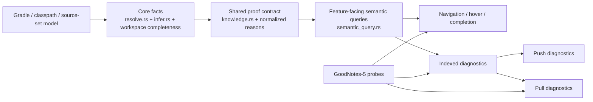

# feat: Drive the compiler-free semantic engine through points 1-4

This plan turns the current semantic-engine roadmap into an execution plan tied to real validation.
It assumes the four workstreams to drive home are:

1. one shared semantic core instead of feature-local uncertainty contracts
2. diagnostics as a first-class LSP product, including pull/workspace diagnostics
3. stronger Kotlin project modeling so semantic facts are less often blocked by incomplete world knowledge
4. broader compiler-free semantic checking without adopting the Kotlin compiler on the hot path

The governing constraint remains unchanged:

- no Kotlin compiler for fast-path semantics
- no JVM dependency in request-path semantic work
- no wrong guesses
- unknown beats invented

## Problem Frame

`ktlsp` already has strong local pieces:

- proof-bounded resolution in [src/resolve.rs](/Users/pepe/.codex/worktrees/fef5/ktlsp/src/resolve.rs)
- shared `Knowledge<T, R>` in [src/knowledge.rs](/Users/pepe/.codex/worktrees/fef5/ktlsp/src/knowledge.rs)
- semantic query seams in [src/semantic_query.rs](/Users/pepe/.codex/worktrees/fef5/ktlsp/src/semantic_query.rs)
- gradual inference and overload filtering in [src/infer.rs](/Users/pepe/.codex/worktrees/fef5/ktlsp/src/infer.rs)
- proof-bounded indexed diagnostics in [src/indexed_diagnostics.rs](/Users/pepe/.codex/worktrees/fef5/ktlsp/src/indexed_diagnostics.rs)

But the system is still split along feature boundaries. Completion still carries ad hoc `reasons: Vec<String>`, diagnostics still expose only the push model, and project completeness remains too coarse for large Gradle workspaces. The next step is not “add more heuristics”; it is to make the semantic contract uniform and then extend only the fact producers that can stay conservative.

## External Baseline

The plan uses `/Users/pepe/projects/github.com/GoodNotes/GoodNotes-5` as the primary real-world testbed.

Current baseline on 2026-07-04:

- `ktlsp` initializes successfully against `Accounts:api` using `AccountsUseCaseImpl.kt`
- `ktlsp` initializes successfully against `web-documents-import:cleaner` using `Registry.kt`
- This proves basic startup and capability advertisement on a large multi-module workspace are already acceptable

Representative GoodNotes-5 Kotlin surfaces to validate against:

- Backend service code:
  [AccountsUseCaseImpl.kt](/Users/pepe/projects/github.com/GoodNotes/GoodNotes-5/Accounts/api/src/main/kotlin/com/goodnotes/accounts/usecase/AccountsUseCaseImpl.kt)
- Smaller service/bootstrap code:
  [Registry.kt](/Users/pepe/projects/github.com/GoodNotes/GoodNotes-5/web-documents-import/cleaner/src/main/kotlin/com/goodnotes/fc/starters/main_event_consumer/Registry.kt)
- Multiplatform model code:
  [Document.kt](/Users/pepe/projects/github.com/GoodNotes/GoodNotes-5/Multiplatform/model/src/main/kotlin/com/goodnotes/multiplatform/model/Document.kt)
- Root Gradle topology:
  [settings.gradle.kts](/Users/pepe/projects/github.com/GoodNotes/GoodNotes-5/settings.gradle.kts)

## Scope Boundaries

This plan does:

- strengthen the semantic core and its LSP exposure
- improve project completeness and source-set/classpath modeling without compiler APIs
- expand only diagnostics that can be proved from parser, index, and gradual facts
- add GoodNotes-grounded probes so semantic progress is measured against real code

This plan does not:

- adopt kotlinc, FIR, Analysis API, or compiler daemons for request-path semantics
- promise compiler-grade assignability, exhaustiveness, or overload-most-specific fidelity
- attempt whole-program fixpoint inference
- replace the existing opt-in compile-diagnostics seam

## Requirements Trace

### Point 1: Shared semantic core

The implementation must converge on one proof-bounded result contract across resolution, completion, hover, and diagnostics.

### Point 2: Diagnostics as a first-class LSP surface

The implementation must serve diagnostics through modern LSP pull endpoints and make diagnostic scope configurable without weakening the conservative contract.

### Point 3: Kotlin project modeling

The implementation must reduce false `Unknown` outcomes caused by incomplete Gradle/classpath/source-set knowledge, especially in large multi-module workspaces.

### Point 4: Compiler-free semantic checking

The implementation must expand semantic facts and high-confidence diagnostics using the existing demand-driven engine, not compiler integration.

## Key Technical Decisions

### KTD1: Keep one semantic contract, not one semantic module

The key deliverable for point 1 is not a big rewrite into a new “engine” module. The real need is a single reusable contract and reason model that existing modules can share. The current architecture in [src/resolve.rs](/Users/pepe/.codex/worktrees/fef5/ktlsp/src/resolve.rs), [src/semantic_query.rs](/Users/pepe/.codex/worktrees/fef5/ktlsp/src/semantic_query.rs), and [src/workspace.rs](/Users/pepe/.codex/worktrees/fef5/ktlsp/src/workspace.rs) is already close enough that an extraction/refactor is lower-risk than a subsystem rewrite.

### KTD2: Pull diagnostics should wrap the existing diagnostic engine, not fork it

Point 2 should not invent a second diagnostic computation path. The existing parser-backed and index-backed diagnostics should stay the source of truth. `textDocument/diagnostic` and `workspace/diagnostic` belong in [src/lsp.rs](/Users/pepe/.codex/worktrees/fef5/ktlsp/src/lsp.rs) as new transport surfaces over the same core logic.

### KTD3: Project completeness must become module- and source-set-aware

Today completeness is too coarse to support ambitious semantic queries safely in large Gradle repositories. The GoodNotes root [settings.gradle.kts](/Users/pepe/projects/github.com/GoodNotes/GoodNotes-5/settings.gradle.kts) shows why: hundreds of modules, mixed JVM and multiplatform targets, and multiple top-level product areas. Point 3 should therefore improve `CompletenessFacts` and the classpath/source-set model rather than broadening diagnostics first.

### KTD4: New diagnostics should be fact-derived, not syntax-triggered

Point 4 only succeeds if every new diagnostic is phrased in terms of proved facts the engine already knows how to explain: known receiver type, visible candidate set, known nullability, closed package world, or stable narrowed local. This keeps diagnostics monotone with the semantic model and avoids a separate bag of one-off checks.

### KTD5: GoodNotes-5 should be used in two modes

The external testbed should serve two different jobs:

- direct project-health validation on real files through the `project` harness scenario
- hermetic semantic regression probes that copy representative GoodNotes code shapes into disposable fixtures under `dev/` or generated harness projects

This split keeps validation reproducible while still ensuring the work is grounded in real Kotlin patterns from a large codebase.

## High-Level Technical Design

This illustrates the intended approach and is directional guidance for review, not implementation specification.

The implementing agent should treat this as an architecture check: project modeling feeds facts, facts feed one proof contract, and transport/features consume that shared contract.

## Implementation Units

### [x] U1. Unify the proof-bounded semantic contract

**Goal:** Finish point 1 by making completion and feature-facing semantic queries use the same contract shape as resolution.

**Files:**

- [src/knowledge.rs](/Users/pepe/.codex/worktrees/fef5/ktlsp/src/knowledge.rs)
- [src/resolve.rs](/Users/pepe/.codex/worktrees/fef5/ktlsp/src/resolve.rs)
- [src/semantic_query.rs](/Users/pepe/.codex/worktrees/fef5/ktlsp/src/semantic_query.rs)
- [src/workspace.rs](/Users/pepe/.codex/worktrees/fef5/ktlsp/src/workspace.rs)
- [src/commands.rs](/Users/pepe/.codex/worktrees/fef5/ktlsp/src/commands.rs)

**Tests:**

- [tests/explain_resolution.rs](/Users/pepe/.codex/worktrees/fef5/ktlsp/tests/explain_resolution.rs)
- [tests/e2e.rs](/Users/pepe/.codex/worktrees/fef5/ktlsp/tests/e2e.rs)
- new semantic-query unit coverage in [src/semantic_query.rs](/Users/pepe/.codex/worktrees/fef5/ktlsp/src/semantic_query.rs)

**Approach:**

- replace ad hoc completion `reasons: Vec<String>` output with a proof-bounded semantic result or a thin wrapper over it
- normalize “unknown because …” reasons so completion, hover, and resolution all emit the same vocabulary
- keep the public explain commands stable where practical, but make them projections of the shared semantic type rather than parallel custom formatting logic

**Test scenarios:**

- unresolved completion on unknown receiver reports the same `unknown` class of outcome as resolution
- import-context and non-completable-position declines are represented explicitly, not as empty candidate sets with bespoke strings
- existing explain-resolution behavior stays intact for `ok`, `definitely-absent`, and `unknown`

### [x] U2. Add pull/workspace diagnostics and diagnostic scope controls

**Goal:** Finish point 2 by serving diagnostics through pull LSP endpoints while preserving the current push path for older clients.

**Files:**

- [src/lsp.rs](/Users/pepe/.codex/worktrees/fef5/ktlsp/src/lsp.rs)
- [src/workspace.rs](/Users/pepe/.codex/worktrees/fef5/ktlsp/src/workspace.rs)
- [src/diagnostics.rs](/Users/pepe/.codex/worktrees/fef5/ktlsp/src/diagnostics.rs)
- [src/indexed_diagnostics.rs](/Users/pepe/.codex/worktrees/fef5/ktlsp/src/indexed_diagnostics.rs)
- [README.md](/Users/pepe/.codex/worktrees/fef5/ktlsp/README.md)

**Tests:**

- [tests/diagnostics.rs](/Users/pepe/.codex/worktrees/fef5/ktlsp/tests/diagnostics.rs)
- [tests/e2e.rs](/Users/pepe/.codex/worktrees/fef5/ktlsp/tests/e2e.rs)

**Approach:**

- implement `textDocument/diagnostic` and `workspace/diagnostic` over the existing diagnostic engine
- add a small settings/config seam for diagnostic scope such as `off`, `openFilesOnly`, and `workspace`
- keep push diagnostics as compatibility behavior, but do not let the two transport paths diverge in computation or merge logic

**Test scenarios:**

- same file returns identical diagnostics through push and pull surfaces
- workspace mode does not invent diagnostics for incomplete/unindexed worlds
- open-files-only mode excludes unopened files while preserving correctness for open buffers
- clients without pull support still receive the current push behavior

### [x] U3. Improve module, classpath, and source-set completeness modeling

**Goal:** Finish point 3 by reducing semantic `Unknown` caused by coarse Gradle/world knowledge.

**Files:**

- [src/classpath.rs](/Users/pepe/.codex/worktrees/fef5/ktlsp/src/classpath.rs)
- [src/deps.rs](/Users/pepe/.codex/worktrees/fef5/ktlsp/src/deps.rs)
- [src/workspace.rs](/Users/pepe/.codex/worktrees/fef5/ktlsp/src/workspace.rs)
- [src/resolve.rs](/Users/pepe/.codex/worktrees/fef5/ktlsp/src/resolve.rs)
- [src/catalog.rs](/Users/pepe/.codex/worktrees/fef5/ktlsp/src/catalog.rs)
- [README.md](/Users/pepe/.codex/worktrees/fef5/ktlsp/README.md)

**Tests:**

- [tests/library_goto.rs](/Users/pepe/.codex/worktrees/fef5/ktlsp/tests/library_goto.rs) if extended
- [tests/goto.rs](/Users/pepe/.codex/worktrees/fef5/ktlsp/tests/goto.rs)
- harness validation through [dev/ktlsp-harness.sh](/Users/pepe/.codex/worktrees/fef5/ktlsp/dev/ktlsp-harness.sh)

**Approach:**

- refine completeness facts so they can express module/package/source-set closure more precisely than the current global booleans
- make source-set specificity and module routing feed completeness and semantic decline reasons
- improve classpath/source discovery using the existing Gradle seam, still without adding compiler APIs

**GoodNotes-5 validation targets:**

- [settings.gradle.kts](/Users/pepe/projects/github.com/GoodNotes/GoodNotes-5/settings.gradle.kts) for large module graph coverage
- [AccountsUseCaseImpl.kt](/Users/pepe/projects/github.com/GoodNotes/GoodNotes-5/Accounts/api/src/main/kotlin/com/goodnotes/accounts/usecase/AccountsUseCaseImpl.kt)
- [Registry.kt](/Users/pepe/projects/github.com/GoodNotes/GoodNotes-5/web-documents-import/cleaner/src/main/kotlin/com/goodnotes/fc/starters/main_event_consumer/Registry.kt)
- [Document.kt](/Users/pepe/projects/github.com/GoodNotes/GoodNotes-5/Multiplatform/model/src/main/kotlin/com/goodnotes/multiplatform/model/Document.kt)

**Test scenarios:**

- a real GoodNotes backend module still initializes and advertises capabilities after the completeness changes
- multiplatform symbols decline with explicit, source-set-aware reasons instead of generic incompleteness
- library and project completeness no longer collapse into the same `unknown` outcome when the module graph is only partially indexed

### [x] U4. Expand fact producers in the gradual semantic core

**Goal:** Finish the semantic side of point 4 by broadening the set of compiler-free facts available to navigation, hover, completion, and diagnostics.

**Files:**

- [src/infer.rs](/Users/pepe/.codex/worktrees/fef5/ktlsp/src/infer.rs)
- [src/resolve.rs](/Users/pepe/.codex/worktrees/fef5/ktlsp/src/resolve.rs)
- [src/semantic_query.rs](/Users/pepe/.codex/worktrees/fef5/ktlsp/src/semantic_query.rs)
- [src/hierarchy.rs](/Users/pepe/.codex/worktrees/fef5/ktlsp/src/hierarchy.rs)
- [src/symbol.rs](/Users/pepe/.codex/worktrees/fef5/ktlsp/src/symbol.rs)

**Tests:**

- [tests/completion.rs](/Users/pepe/.codex/worktrees/fef5/ktlsp/tests/completion.rs)
- [tests/goto.rs](/Users/pepe/.codex/worktrees/fef5/ktlsp/tests/goto.rs)
- [tests/explain_resolution.rs](/Users/pepe/.codex/worktrees/fef5/ktlsp/tests/explain_resolution.rs)

**Approach:**

- focus on fact producers that can improve multiple features at once: receiver typing through common chain shapes, generic propagation through common stdlib builder/result chains, and stable local nullability/narrowing facts
- prefer “more proved facts” over “more fallback guesses”
- expand explainability whenever a new fact producer can decline for a specific reason

**GoodNotes-derived semantic shapes to cover hermetically:**

- `Result` / `runCatching` / `map` / `onFailure` / `getOrThrow` chains from [AccountsUseCaseImpl.kt](/Users/pepe/projects/github.com/GoodNotes/GoodNotes-5/Accounts/api/src/main/kotlin/com/goodnotes/accounts/usecase/AccountsUseCaseImpl.kt)
- `buildMap`, nested `when`, and nullable chained JSON access from the same file
- serializer/config bootstrap and `when (mode)` branch selection from [Registry.kt](/Users/pepe/projects/github.com/GoodNotes/GoodNotes-5/web-documents-import/cleaner/src/main/kotlin/com/goodnotes/fc/starters/main_event_consumer/Registry.kt)

**Test scenarios:**

- completion on chained receivers preserves the right container type through common result/builder shapes
- hover and explanation surfaces identify why a chain breaks when inference still cannot close
- member lookup on known receiver types is strengthened without broadening fallback ambiguity

### [x] U5. Expand high-confidence diagnostics from shared facts

**Goal:** Finish the diagnostic side of point 4 by adding new sparse, trustworthy diagnostics derived from the strengthened fact model.

**Files:**

- [src/indexed_diagnostics.rs](/Users/pepe/.codex/worktrees/fef5/ktlsp/src/indexed_diagnostics.rs)
- [src/diagnostics.rs](/Users/pepe/.codex/worktrees/fef5/ktlsp/src/diagnostics.rs)
- [src/semantic_query.rs](/Users/pepe/.codex/worktrees/fef5/ktlsp/src/semantic_query.rs)
- [README.md](/Users/pepe/.codex/worktrees/fef5/ktlsp/README.md)

**Tests:**

- [tests/diagnostics.rs](/Users/pepe/.codex/worktrees/fef5/ktlsp/tests/diagnostics.rs)
- new focused fixtures under [tests/diagnostics.rs](/Users/pepe/.codex/worktrees/fef5/ktlsp/tests/diagnostics.rs)

**Approach:**

- keep existing unresolved-reference and call-shape diagnostics as the pattern to follow
- add only diagnostics backed by explicit facts, for example:
  - missing member on a known receiver in a closed world
  - obvious nullability misuse on stable locals when both the narrowed and required facts are proved
  - argument-count or argument-shape cases where every surviving target proves mismatch
- every new diagnostic must have a corresponding explainable proof boundary

**Test scenarios:**

- positive cases fire only when receiver type, visibility world, and relevant semantic facts are closed
- the same inputs stay silent if any fact downgrades from proved to unknown
- GoodNotes-derived chain shapes do not produce false positives in partial worlds

### [x] U6. Add a dedicated GoodNotes semantic probe harness

**Goal:** Make GoodNotes-5 a durable external validation layer rather than a one-off manual check.

**Files:**

- [dev/ktlsp-harness.sh](/Users/pepe/.codex/worktrees/fef5/ktlsp/dev/ktlsp-harness.sh)
- [dev/nvim_project.lua](/Users/pepe/.codex/worktrees/fef5/ktlsp/dev/nvim_project.lua)
- new GoodNotes-focused probe(s) under [dev/](/Users/pepe/.codex/worktrees/fef5/ktlsp/dev)
- [README.md](/Users/pepe/.codex/worktrees/fef5/ktlsp/README.md)

**Tests:**

- harness-driven verification, not pure Rust tests

**Approach:**

- keep the current `project` scenario for broad health
- add one or more targeted probes that exercise semantic features against selected GoodNotes files or extracted snippets
- store probe expectations in ktlsp, not in GoodNotes-5, so validation remains reproducible from this repo

**Validation matrix:**

- project health on `Accounts:api`
- project health on `web-documents-import:cleaner`
- semantic probe derived from `AccountsUseCaseImpl.kt`
- semantic probe derived from `Registry.kt`
- at least one multiplatform probe derived from `Multiplatform:model`

## System-Wide Impact

- [src/lsp.rs](/Users/pepe/.codex/worktrees/fef5/ktlsp/src/lsp.rs) will become the compatibility boundary for old push diagnostics and new pull diagnostics
- [src/workspace.rs](/Users/pepe/.codex/worktrees/fef5/ktlsp/src/workspace.rs) will take on more responsibility for semantic-query reuse and diagnostic scoping
- [README.md](/Users/pepe/.codex/worktrees/fef5/ktlsp/README.md) must be updated as work lands; it currently understates some shipped semantic behavior and will drift further if not corrected
- GoodNotes-5 becomes an external regression signal, so probe stability and selection discipline matter

## Risks And Mitigations

- Risk: point 2 adds a second diagnostics transport path that diverges from the push path.
  Mitigation: treat the core diagnostic engine as the single source of truth and test parity explicitly.

- Risk: point 3 broadens project modeling in ways that slow startup or indexing.
  Mitigation: keep completeness more precise before making it more eager; measure with the existing harness and bench seams.

- Risk: point 4 slips into compiler imitation and starts inventing weak heuristics.
  Mitigation: every new fact producer and diagnostic must explain its proof boundary and degrade to `Unknown`.

- Risk: GoodNotes-5 is too large and too volatile to use as a stable direct fixture.
  Mitigation: split direct health checks from hermetic probes derived from representative code shapes.

## Sequencing

Recommended order:

1. U1 shared semantic contract
2. U3 completeness and project modeling
3. U4 fact-producer expansion
4. U5 high-confidence diagnostics expansion
5. U2 pull/workspace diagnostics and scope controls
6. U6 GoodNotes probe harness finalization

Rationale:

- point 1 is foundational and lowers cost for every later unit
- point 3 must come before aggressive semantic diagnostics so “unknown because incomplete world” becomes more precise
- point 4 should strengthen facts before point 5 consumes them in more diagnostics
- point 2 can ship earlier, but it is safer after the core diagnostic engine shape stabilizes

## Success Criteria

- completion, hover, and resolution all use one proof-bounded result vocabulary
- diagnostics are available through pull and workspace LSP endpoints without behavior drift
- GoodNotes-5 health probes continue to pass on representative modules
- at least one GoodNotes-derived semantic probe moves from `unknown` or empty result to a proved semantic result
- new diagnostics remain sparse and explainable, with no known false positives introduced by partial project worlds

## First Execution Slice

The first implementation pass should target U1 and U3 together:

- finish the shared contract
- make completeness more precise on real Gradle workspaces

That combination gives the next passes a stable foundation and makes GoodNotes-5-based semantic failures more legible.
